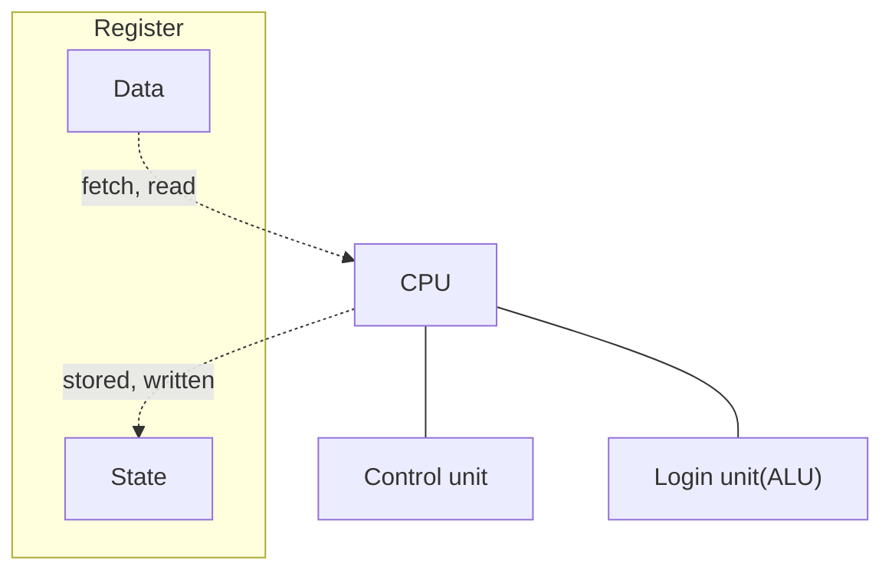
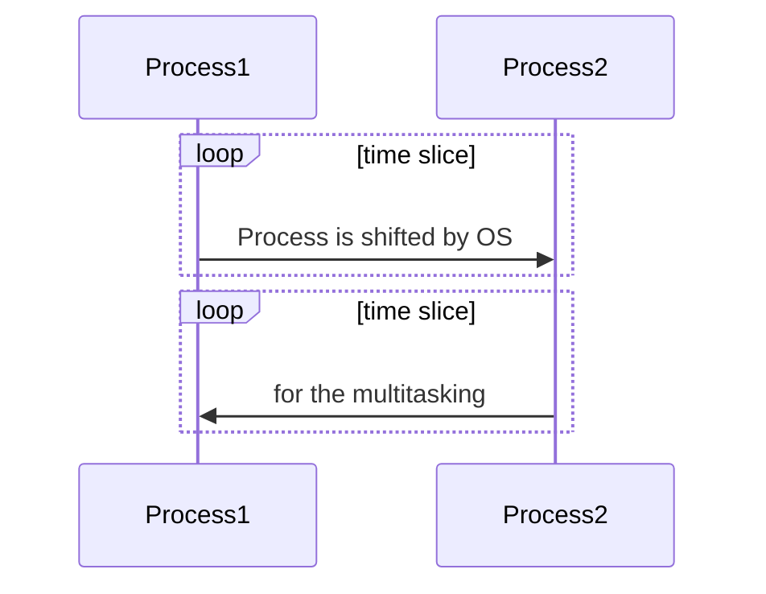

# 병렬 하드웨어와 소프트웨어

## 배경 지식

> Von Neumann architecture

Main memory, CPU, processor or core, and interconnection


-   Control Unit: 어떤 명령어가 실행될지 순서를 결정
-   ALU: 실제 명령어를 실행
-   Register: 매우 빠른 메인 메모리 (저장 장치)
-   CPU 와 register 는 bus 를 통해 interconnection 된다.

> Operating System

운영체제는 하드웨어와 소프트웨어 리소스를 관리한다. 즉, 어떤 프로그램을 언제 실행할지를 결정하고, 메모리 할당과 디바이스 엑세스를 제어한다.

> Process, multitasking, and thread



사용자가 프로그램을 실행할 때 운영체제는 프로세스를 생성한다. 실행 중인 프로그램이 하나의 타임 슬라이스에서 실행되고 나면 운영체제는 다른 프로세스를 실행한다. 그 이유는 각 프로세스가 작은 시간 단위로 수행되어야 멀티태스킹이 가능하기 때문이다.


```wavedrom
{signal: [
  {name:'Time slice',  wave: 'p......' },
  {name:'Process',     wave: 'x=.345x', data: 'a b c' },
  {name:'Thread1',     wave: '01.0.10' },
  {name:'Thread2',     wave: '0.1110.' }
],
 head:{
   text:'Threads forked from process',
   tick:0,
 },
}
```
프로그램을 서로 독립적인 태스크로 나눈 것이 스레드이고, 독립적인 태스크는 하나의 스레드가 잠시 멈춘다고 하더라도 다른 스레드는 실행 가능하다.

## 폰 노이만 모델의 수정

### 캐시의 기본 순서

CPU와 가까운 순서대로

-   Level1: 가장 작고 빠르다.
-   L2, L3, ...: 점점 커지고 느려진다.

### 명령어 레벨 병렬화(instruction-level parallelism)

프로세스 function unit 이 동시에 명령어를 실행하여 프로세서의 성능을 향상시키는 방법이다. ILP 에는 두 가지 주요한 방법이 존재한다.

-   Pipelining: 태스크를 여러 개의 분리된 하드웨어나 펑션 유닛으로 분할해서 처리한다. --> 하드웨어나 펑션 유닛을 개별적으로 사용한다.
-   Multiple issue: 펑션 유닛을 복제하고 프로그램에서 다른 명령어를 동시에 실행하도록 한다. --> 장치가 많아질 수록 성능 증가

## 병렬 하드웨어

### SIMD System

한 번에 하나의 명령어(control unit이 지배)가 실행되며, 여러 데이터 아이템을 다루는 다중 데이터 스트림(ALU가 지배)으로 페치되거나 저장된다.

예를 들어, for loop 를 실행한다고 할 때,

```cpp
for (size_t i = 0; i < n; i++) {
    x[i] += y[i];
}
```

SIMD 시스템이 n 개의 ALU를 갖고 있다고 가정한다면, 동시에 n개의 항목에 대한 블록 덧셈을 할 수 있다.

> 벡터 프로세서

시리얼 코드를 자동으로 벡터라이징 할 수 있고, 안 된다면 컴파일 로그를 띄워준다. 하지만 아직까지는 매우 제한된 환경에서 동작한다.

> **GPU**

그래픽 프로세싱 파이프라인을 사용하여 내부 표현을 픽셀의 배열로 변환하여 컴퓨터 화면에 보낸다. 이 파이프라인의 몇 단계는 프로그래밍이 가낭하다. 프로그래밍이 가능한 단계의 behavior 는 shader function 에 의해 설정된다. 셰이더 함수는 일반적으로는 짧고, 몇 줄 안되는 C 코드로 되어 있다. 이 함수는 묵시적으로 병렬화되어 있다. 그 이유는 그래픽 스트림에서 여러 항목 (예를 들어, vertex 와 같은)에 적용되기 때문이다. 근처 항목에 셰이더 함수를 적용하는 애플리케이션은 동일한 컨트롤 플로의 결과가 되기 때문에 GPU는 SIMD 병렬화를 사용하여 성능을 최적화한다.

### MIMD System

다중 명령어, 다중 데이터 시스템은 일반적으로 완전히 독립적인 프로세싱 유닛이나 코어의 집합으로 구성되어 있고, 각 코어는 자신만의 컨트롤 유닛과 ALU를 갖고 있다. 더 나아가, SIMD 시스템과 달리 MIMD는 대개 비동기적이다. 이 말은 프로세서들이 각자의 속도로 동작한다는 의미다.

> 캐시 일관성


> 거짓 공유

```cpp
// thread 1
int a[1000];     
int b[1000];     

while( true ) {
     a[ 998 ] = i * 1000;
}
```
```cpp
// thread 2
int a[1000];     
int b[1000];     

while( true ) {
     b[ 0 ] = i ;
}
```

스레드 1의 경우는 a[998]에 데이터를 삽입하기 위해서, a[998] 부터 64바이트의 데이터 즉, b[13]까지의 데이터가  어느 캐시 라인에 적재 된다. (이 캐시라인을 A 캐시 라인이라고 하자.)

물론, 코드 1에서는 b의 배열의 요소는 사용하지 않는다.

그런데, 스레드2는 b의 배열을 사용하고 있다.

스레드 2의 경우, 루프가 가동되어  b[0]에 접근하는 경우 b[0]부터 b[15] 까지의 데이터가 또 다른 캐시 라인에 적재된다. (이 캐시라인은 B 캐시 라인이라고 하자.)

그런데 동시에 가동되고 있던 스레드1 때문에  b[0]부터 b[13]까지의 데이터가 이미 A 캐시 라인에 적재되어 있다.

프로세서 차원에서는 b[0]의 데이터가 이미 캐시라인 A로부터 데이터가 변경되었을 수도 있다고 생각한다. 따라서 B캐시 라인에 적재하기 전에 A 캐시라인으로부터 a[998]부터 b[13]까지의 데이터를 주 메모리로  갱신(flush) 해줘야 한다. 그리고 나선 갱신된 이후의 데이터 b[0]~b[15]까지의 데이터를 B캐시 라인에 적재한다.

역으로,

스레드 1에서 a[998]에 데이터를 삽입하려고 하는데, 스레드2에서 이미 b[0]부터 데이터가 B캐시 라인에 적재되어 있으니, B캐시 라인의 데이터를 주 메모리로 플러쉬 한 후,  a[998]부터 b[13]까지의 데이터를 A캐시 라인에 적재하게 된다.

각 스레드 입장에서는 캐시라인의 데이터를 주 메모리로  갱신해주지 않아도 전혀 문제되지 않을 코드인데, 프로세서 차원에서는 거기까지의 사실을 알지못하고 일단 무조건 갱신한다는 게 바로 문제다.  따라서 쓸데없는 작업 과정으로 인한 작업 효과가 매우 비효율적임을 알 수 있다.

[출처] [메모리 거짓 공유 (Memory False Sharing)|작성자 Hermet](http://blog.naver.com/PostView.nhn?blogId=hermet&logNo=68290454&parentCategoryNo=&categoryNo=29&viewDate=&isShowPopularPosts=false&from=postView)

결론은 **거짓 공유는 이상한 결과의 원인이 되지는 않는다.** 그러나 필요한 것보다 **더 많은 메모리 액세스로** 인해 프로그램의 성능을 저하시킬 수 있다.

## 병렬 소프트웨어

일반적으로 공유 메모리 프로그램을 실행할 때 하나의 프로세서에서 시작해서 여러 스레드로 포크(fork)한다. 다른 한편, 분산 메모리 프로그램을 실행할 때 여러 프로세스를 시작한다.

Task and Data parallel

```cpp
/*Task parallel*/

if (//tread or process #0)
  /*do this*/;
else
  /*do that*/;
```

```cpp
/*Data parallel*/

if (//tread or process #0)
  /*do until a half of the array*/;
else
  /*do from a half of the array*/;
```

병렬화하기 위한 작업 흐름

1.   **Load Balancing**: 작업을 프로세스/스레드별로 분할한다.
  -   각 프로세스/스레드는 간단하게 같은 양의 작업을 할당받게 된다.
  -   통신하는 데 필요한 데이터는 최소화해야 한다.
1.   **Synchronization**: 프로세스/스레드 동기화를 준비해야 한다.
1.   **Communication**: 프로세스/스레드 간의 통신을 준비해야 한다.

> 공유 메모리

-   공유(share) 변수: 어떤 스레드에서도 읽고 쓸 수 있다. (e.g. 스레드 간의 통신에 이용)
-   프라이빗(private) 변수: 일반적으로 하나의 스레드에 의해서만 액세스가 가능하다.

많은 환경에서 공유 메모리 프로그램은 dynamic thread 이다. 이러한 패러다임에서는 마스터 스레드와 주어진 순간의 worker thread 의 집합으로 되어 있다. 마스터 스레드는 일반적으로 예를 들어, 네트워크를 통해 작업 요청을 기다린다. 새로운 요청이 도착하면 워크 스레드를 포크하고 스레드는 요청 사항을 수행하며, 스레드가 작업을 완료하면 해당 스레드는 종료하고 마스터 스레드에 조인한다. 이러한 패러다임은 스레드에 의해 요청된 리소스가 실제 스레드가 동작하는 동안에만 사용되기 때문에 시스템 리소스의 효율적인 사용을 가능하게 해준다.

동적 패러다임과 다른 형태는 static thread 패러다임이다. 이 패러다임에서는 마스터 스레드에 의해 모든 필요한 셋업이 된 후에 모든 스레다가 포크되며, 모든 작업이 완료될 때까지 스레드가 동작한다. 스레드가 마스터 스레드에 조인한 후에 마스터 스레드는 약간의 클린업 과정(예를 들면, 메모리 해제 등)을 하게 되며, 그러고 나서 종료한다. 리소스의 사용 측면에서는 이러한 방법은 효과적이지 못하다. 스레드가 idle 이면 해당 리소스(예를 들면, 스택, 프로그램 카운터 등) 는 해제되지 못한다. 그러나 스레드를 포크하고 조인하는 것이 꽤 시간 소모적인 오퍼레이션이 될 수 있다. 따라서 필요한 리소스가 사용 가능하면 정적 스레드 패러다임은 동적 패러다임보다 더 좋은 성능을 보여 준다. 이것은 분산 메모리 프로그래밍을 위해 가장 보편적으로 사용하는 패러다임인다.

**비결정론**

MIMD 시스템에서 프로세서는 비동기로 실행하며 그것은 nondeterminism 처럼 보인다. 주어진 입력이 다른 결과를 가져온다면 연산은 비결정적이다.

예를 들어, 스레드 0 에는 my_x =7을, 스레드 1 에는 my_x = 19를 갖고 있다고 가정해 보자. 이때 각각의 my_x를 출력한다고 할 때,

```cpp
printf("Thread &d > my_val = &d\n", my_rank, my_x);
```

문장을 완료하는 상대적인 비율이 실행마다 달라서, 출력이 아래 둘 중 어느 것으로 나올 지 알 수 없다.

```cpp
Thread 0 > my_val = 7
Thread 1 > my_val = 19
```

```cpp
Thread 0 > my_val = 19
Thread 1 > my_val = 7
```

이러한 문제(비결정론)가 공유 메모리 프로그램의 경우는 큰 문제가 되는 경우가 있다. 여기 두 개의 스레드를 사용한 간단한 예제가 있다. 각 스레드는 int를 계산하며 그것은 프라이빗 변수 my_val에 저장된다. 또한, my_val에 저장된 값을 덧셈하여 초기값이 0으로 설정된 공유 메모리 위치 x에 덧셈한다고 가정하자. 두 개의 스레드는 다음과 같은 코드를 실행하게 된다.

```cpp
my_val = Compute_val(my_rank);
x += my_val;
```

Time  | Core 0  | Core 1
--|---|--
  0 | Allocate 'my_val'  | Call 'val' for calculating
  1 | Load 'x = 0' on register  |  Allocate 'my_val'
  2 | Load 'my_val = 7' on register  |  Load 'x = 0' on register
  3 | Add 'my_val' to 'x'  |  Load 'my_val = 19' on register
  4 | Save 'x = 7'  |  Add 'x' to 'my_val'
  5 | Do some other works  |  Save 'x = 19'

여기서의 비결정성은 두 개의 스레드가 동시에 메모리 위치 x를 업데이트 하려고 시도했기 때문에 발생한 결과이다. 스레드나 프로세스가 동시에 리소스를 액세스하려고 시도할 때 그 액세스의 결과는 에러가 되며, 이런 경우에 프로그램이 **race condition** 을 갖는다고 말한다.

이 경우에, 하나의 스레드가 다른 스레드가 시작하기 전에 'x += my_val' 연산을 완료하지 않으면 결과는 틀리게 된다. 한 번에 하나의 스레드에 의해 실행되는 코드의 블록을 **critical section** 이라고 하며, 프로그래머로서 우리의 직업은 크리티컬 섹션에 대한 액세스를 **mutual exclusion** 으로 액세스하도록 보장하는 것이다.

상호 배제를 보장하기 위해 사용하는 가장 공통적인 방법은 **mutual exclusion lock**, **mutex**, or **lock** 이다.  기본 아이디어는 각 크리티컬 섹션은 락에 의해 보호된다는 것이다. 스레드가 크리티컬 섹션에 있는 코드를 실행하기 전에 뮤텍스 함수를 호출하여 뮤텍스를 "획득"해야 한다. 크리티컬 섹션의 코드 실행이 완료되면, unlock 함수를 호출하여 뮤텍스를 "포기"한다. 다른 스레드가 락을 "소유"한다면 이것은 락 함수에 대한 호출로부터의 리턴이지만, 언락 함수를 아직 호출하지는 않은 것이다. 크리티컬 섹션에 있는 코드를 실행하려고 하는 다른 스레드는 락 함수를 호출하기까지 대기한다.  이렇게 코드 함수가 정상적으로 동작하는 것을 보장하기 위해 다음과 같이 코드를 수정한다.

```cpp
my_val = Compute_val(my_rank);
Lock(&add_my_val_lock);
x += my_val;
Unlock(&add_my_val_lock);
```

이것은 단지 한 번에 하나의 스레드만이 'x += my_val' 문장을 실행하도록 해 준다. 단, 코드는 스레드에서 미리 정의된 순서로 실행되도록 강요되지 않는다는 것을 기억하자.

뮤텍스는 내부 하드웨어에서 지원하는 객체의 특별한 타입을 말한다. 크리티컬 섹션의 순차성(serialization)은 뮤텍스가 보장한다.

뮤텍스에 대한 대안으로는, **busy-waiting** 이다. 비지-웨이팅에서 스레드가 루프에 들어가는 유일한 목적은 컨디션을 테스트하는 것이다. 예제에서 공유 변수 ok_for_1 이 거짓으로 초기화됐다고 가정하자. 다음의 코드와 같은 경우는 스레드 0이 x를 없데이트한 후까지 스레드 1은 x를 업데이트하지 않는다는 것을 보장한다.

```cpp
my_val = Compute_val(my_rank);
if (my_rank == 1) {
  while (!ok_for_1);  /*busy-wait loop*/
}
x += my_val;          /*critical section*/
if (my_rank == 0) {
  ok_for_1 = true;    /*Let thread 1 update x*/
}
```

이것은 간단하게 이해할 수 있는 개념이며 구현도 쉽다. 그러나 시스템 리소스를 매우 낭비한다. 스레드가 유용한 일을 하지 않는다고 하더라도, 스레드를 실행하는 코어는 반복적으로 크리티컬 섹션에 진입 가능한지를 체크하게 된다.

**Semaphore** 는 자세한 동작 방식이 약간의 차이가 있을 수 있으나 근본적으로 뮤텍스와 비슷하다.

현재까지 연구되어 온 다른 여러 가지 대안들이 있지만 널리 사용될 만큼 유용한 것은 아니다. 가장 주목 받는 것 중의 하나는 **transactional memory** 이다. 데이터 베이스 관리 시스템에서 트랜잭션은 시스템이하나의 유닛으로 처리하는 데이터베이스의 액세스를 의미한다. 예를 들어, 저축 계좌에서 입출금 계좌로 천만 원을 전송하는 것은 여러분들의 은행에서는 하나의 트랜잭션으로 처리되어야 한다. 따라서 소프트웨어가 입출금 계좌에 대해 크레딧 없이 저축 계좌에서 입출금할 수 없다. 소프트웨어가 저축 계좌에서 입출금이 가능하다면 입출금 계좌를 크레딧하는 것이 불가능하게 되며 트랜잭션은 rollback 된다. 다른 말로 하면 트랜잭션은 완전히 완료되거나 부분적인 변경은 삭제된다. 트랜잭션 메모리의 기본 아이디어는 공유 메모리 프로그램에서의 크리티컬 섹션이 트랜잭션처럼 처리되어야 한다는 점이다. 둘 중 하나의 스레드가 크리티컬 섹션에서 성공적으로 완료하거나 혹은 부분적인 결과는 롤백되고 크리티컬 섹션은 반복된다.

> 분산 메모리

## 입력과 출력

## 성능

## 병렬 프로그램 디자인

## 병렬 프로그램의 작성과 실행

## 가정
