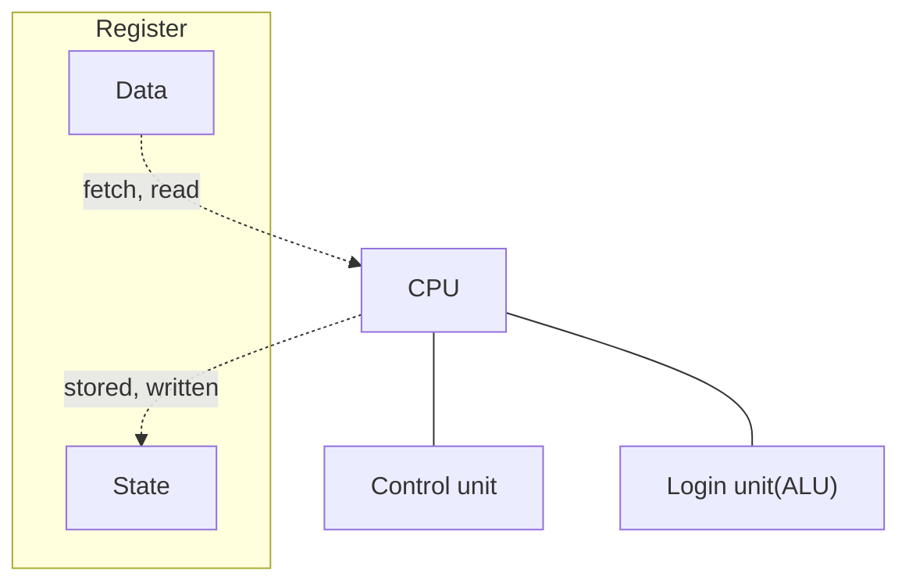
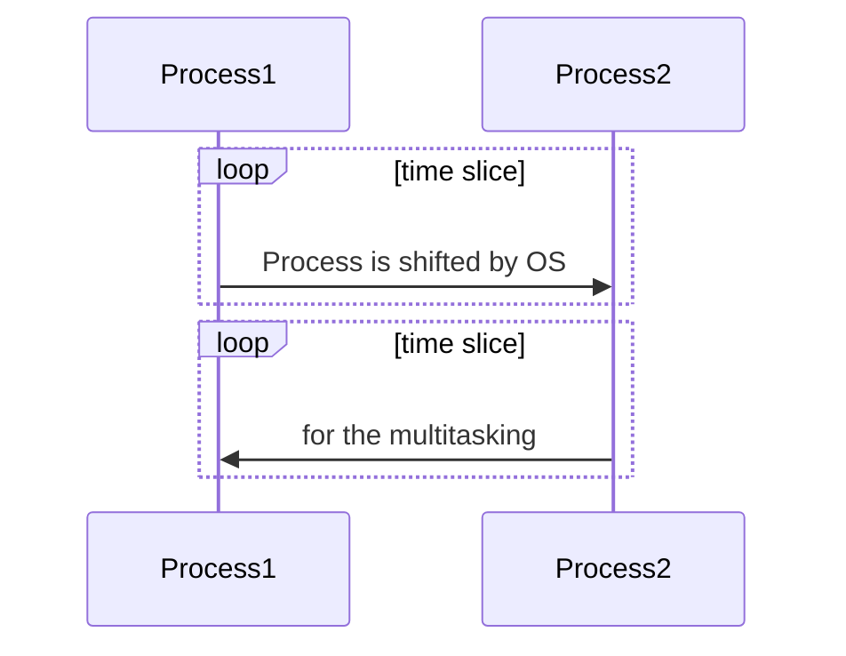

# 병렬 하드웨어와 소프트웨어

## 배경 지식

> Von Neumann architecture

Main memory, CPU, processor or core, and interconnection


-   Control Unit: 어떤 명령어가 실행될지 순서를 결정
-   ALU: 실제 명령어를 실행
-   Register: 매우 빠른 메인 메모리 (저장 장치)
-   CPU 와 register 는 bus 를 통해 interconnection 된다.

> Operating System

운영체제는 하드웨어와 소프트웨어 리소스를 관리한다. 즉, 어떤 프로그램을 언제 실행할지를 결정하고, 메모리 할당과 디바이스 엑세스를 제어한다.

> Process, multitasking, and thread



사용자가 프로그램을 실행할 때 운영체제는 프로세스를 생성한다. 실행 중인 프로그램이 하나의 타임 슬라이스에서 실행되고 나면 운영체제는 다른 프로세스를 실행한다. 그 이유는 각 프로세스가 작은 시간 단위로 수행되어야 멀티태스킹이 가능하기 때문이다.


```wavedrom
{signal: [
  {name:'Time slice',  wave: 'p......' },
  {name:'Process',     wave: 'x=.345x', data: 'a b c' },
  {name:'Thread1',     wave: '01.0.10' },
  {name:'Thread2',     wave: '0.1110.' }
],
 head:{
   text:'Threads forked from process',
   tick:0,
 },
}
```
프로그램을 서로 독립적인 태스크로 나눈 것이 스레드이고, 독립적인 태스크는 하나의 스레드가 잠시 멈춘다고 하더라도 다른 스레드는 실행 가능하다.

## 폰 노이만 모델의 수정

### 캐시의 기본 순서

CPU와 가까운 순서대로

-   Level1: 가장 작고 빠르다.
-   L2, L3, ...: 점점 커지고 느려진다.

### 명령어 레벨 병렬화(instruction-level parallelism)

프로세스 function unit 이 동시에 명령어를 실행하여 프로세서의 성능을 향상시키는 방법이다. ILP 에는 두 가지 주요한 방법이 존재한다.

-   Pipelining: 태스크를 여러 개의 분리된 하드웨어나 펑션 유닛으로 분할해서 처리한다. --> 하드웨어나 펑션 유닛을 개별적으로 사용한다.
-   Multiple issue: 펑션 유닛을 복제하고 프로그램에서 다른 명령어를 동시에 실행하도록 한다. --> 장치가 많아질 수록 성능 증가

## 병렬 하드웨어

### SIMD System

한 번에 하나의 명령어(control unit이 지배)가 실행되며, 여러 데이터 아이템을 다루는 다중 데이터 스트림(ALU가 지배)으로 페치되거나 저장된다.

예를 들어, for loop 를 실행한다고 할 때,

```cpp
for (size_t i = 0; i < n; i++) {
    x[i] += y[i];
}
```

SIMD 시스템이 n 개의 ALU를 갖고 있다고 가정한다면, 동시에 n개의 항목에 대한 블록 덧셈을 할 수 있다.

> 벡터 프로세서

시리얼 코드를 자동으로 벡터라이징 할 수 있고, 안 된다면 컴파일 로그를 띄워준다. 하지만 아직까지는 매우 제한된 환경에서 동작한다.

> **GPU**

그래픽 프로세싱 파이프라인을 사용하여 내부 표현을 픽셀의 배열로 변환하여 컴퓨터 화면에 보낸다. 이 파이프라인의 몇 단계는 프로그래밍이 가낭하다. 프로그래밍이 가능한 단계의 behavior 는 shader function 에 의해 설정된다. 셰이더 함수는 일반적으로는 짧고, 몇 줄 안되는 C 코드로 되어 있다. 이 함수는 묵시적으로 병렬화되어 있다. 그 이유는 그래픽 스트림에서 여러 항목 (예를 들어, vertex 와 같은)에 적용되기 때문이다. 근처 항목에 셰이더 함수를 적용하는 애플리케이션은 동일한 컨트롤 플로의 결과가 되기 때문에 GPU는 SIMD 병렬화를 사용하여 성능을 최적화한다.

### MIMD System

다중 명령어, 다중 데이터 시스템은 일반적으로 완전히 독립적인 프로세싱 유닛이나 코어의 집합으로 구성되어 있고, 각 코어는 자신만의 컨트롤 유닛과 ALU를 갖고 있다. 더 나아가, SIMD 시스템과 달리 MIMD는 대개 비동기적이다. 이 말은 프로세서들이 각자의 속도로 동작한다는 의미다.

> 공유 메모리

> 분산 메모리

> 캐시 일관성


> 거짓 공유

```cpp
// thread 1
int a[1000];     
int b[1000];     

while( true ) {
     a[ 998 ] = i * 1000;
}
```
```cpp
// thread 2
int a[1000];     
int b[1000];     

while( true ) {
     b[ 0 ] = i ;
}
```

스레드 1의 경우는 a[998]에 데이터를 삽입하기 위해서, a[998] 부터 64바이트의 데이터 즉, b[13]까지의 데이터가  어느 캐시 라인에 적재 되겠지요. (이 캐시라인을 A 캐시 라인이라고 합시다.)

물론 코드 1에서는 b의 배열의 요소는 사용하지 않습니다.

그런데, 스레드2는 b의 배열을 사용하고 있습니다.

스레드 2의 경우, 루프가 가동되어  b[0]에 접근하는 경우 b[0]부터 b[15] 까지의 데이터가 또 다른 캐시 라인에 적재되겠지요. (이 캐시라인은 B 캐시 라인이라고 합시다.)

그런데 동시에 가동되고 있던 스레드1 때문에  b[0]부터 b[13]까지의 데이터가 이미 A 캐시 라인에 적재되어 있습니다.

프로세서 차원에서는 b[0]의 데이터가 이미 캐시라인 A로부터 데이터가 변경되었을 수도 있다고 생각합니다. 따라서 B캐시 라인에 적재하기 전에 A 캐시라인으로부터 a[998]부터 b[13]까지의 데이터를 주 메모리로  갱신(flush) 해줘야 합니다. 그리고 나선 갱신된 이후의 데이터 b[0]~b[15]까지의 데이터를 B캐시 라인에 적재하지요.

역으로,

스레드 1에서 a[998]에 데이터를 삽입하려고 하는데, 스레드2에서 이미 b[0]부터 데이터가 B캐시 라인에 적재되어 있으니, B캐시 라인의 데이터를 주 메모리로 플러쉬 한 후,  a[998]부터 b[13]까지의 데이터를 A캐시 라인에 적재하게 됩니다.

각 스레드 입장에서는 캐시라인의 데이터를 주 메모리로  갱신해주지 않아도 전혀 문제되지 않을 코드인데, 프로세서 차원에서는 거기까지의 사실을 알지못하고 일단 무조건 갱신한다는 게 바로 문제이지요.  따라서 쓸데없는 작업 과정으로 인한 작업 효과가 매우 비효율적임을 알 수 있습니다.

[출처] [메모리 거짓 공유 (Memory False Sharing)|작성자 Hermet](http://blog.naver.com/PostView.nhn?blogId=hermet&logNo=68290454&parentCategoryNo=&categoryNo=29&viewDate=&isShowPopularPosts=false&from=postView)

## 병렬 소프트웨어

## 입력과 출력

## 성능

## 병렬 프로그램 디자인

## 병렬 프로그램의 작성과 실행

## 가정
