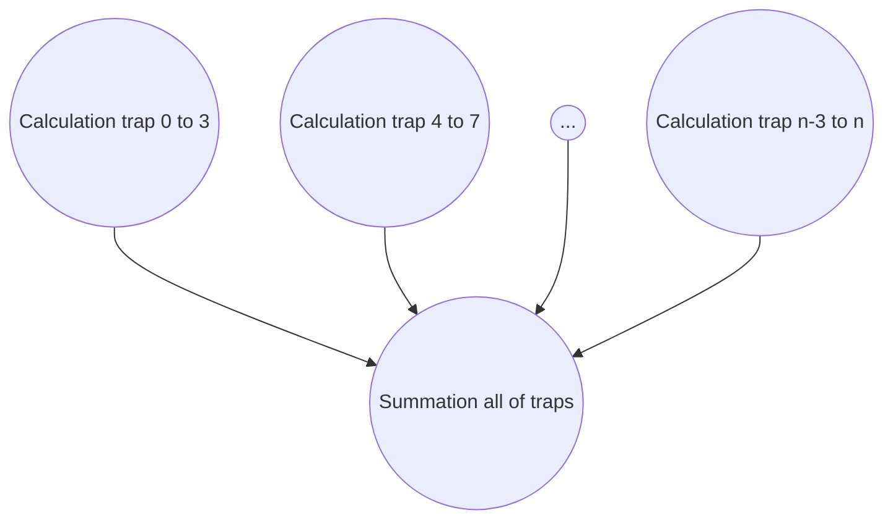
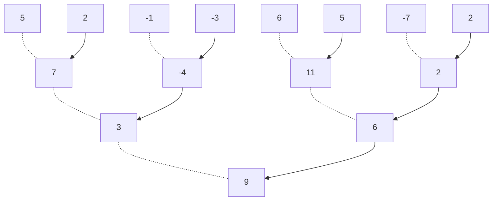
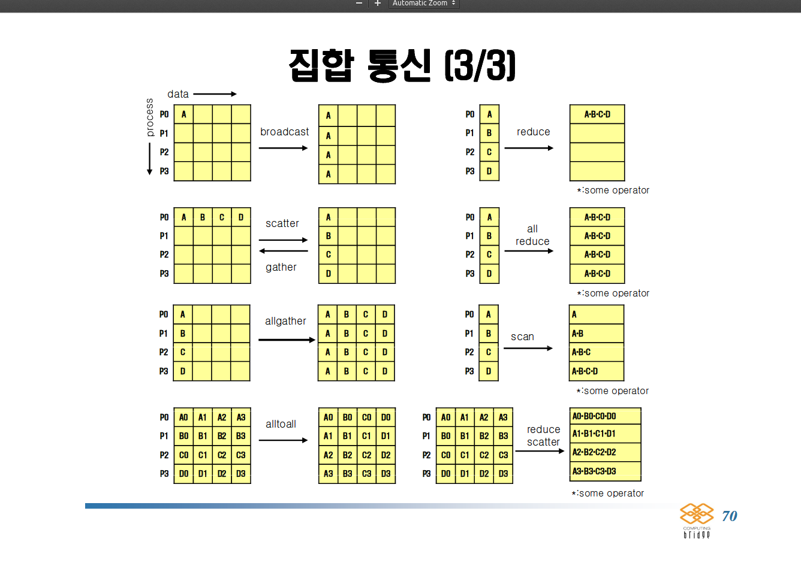

# MPI를 이용한 분산 메모리 프로그래밍

메시지 패싱 프로그램에서 코어-메모리에서 실행되는 프로그램을 보통 process 라고 하고, 두 개의 프로세스는 send 함수라고 하는 프로세스와 receive 함수라고 하는 프로세스를 사용하여 통신한다. 또한, 두 개 이상의 프로세스를 포함하는 "글로벌" 통신, 함수들을 collective 통신이라고 한다. MPI 함수들에 대하여 배우는 과정에서 분산 메모리 시스템의 데이터 파티셔닝과 I/O 와 같은 메시지 패싱 프로그램 이슈를 포함한 기본적인 이슈에 대해서 배울 것이다. 병렬 프로그램 성능 관련 이슈에 대해서도 알아볼 것이다.

## Hello, world!

```c {.line-numbers}
#include <stdio.h>
#include <string.h>
#include <mpi.h>

const int MAX_STRING = 100;

int main(void) {
  char  greeting[MAX_STRING];
  int   comm_sz;    /* the number of processes */
  int   my_rank;    /* process' ranking number */

  MPI_Init(NULL, NULL);
  MPI_Comm_size(MPI_COMM_WORLD, &comm_sz);
  MPI_Comm_rank(MPI_COMM_WORLD, &my_rank);

  if (my_rank != 0) {
    sprintf(greeting, "Greetings from process %d of %d!", my_rank, comm_sz);
    MPI_Send(greeting, strlen(greeting) + 1, MPI_CHAR, 0, 0, MPI_COMM_WORLD);
  } else {
    printf("Greetings from process %d of %d!\n", my_rank, comm_sz);
    for (int q = 1; q < comm_sz; q++) {
      MPI_Recv(greeting, MAX_STRING, MPI_CHAR, q, 0, MPI_COMM_WORLD, MPI_STATUS_IGNORE);
      printf("%s\n", greeting);
    }
  }

  MPI_Finalize();
  return 0;
}
```

각 프로세스가 간단하게 메시지를 출력하는 대신 하나의 프로세스가 출력을 맡고 다른 프로세스는 메시지를 전송하도록 설계했다. 병렬 프로그램에서 음수가 아닌 정수형 rank 를 사용하여 프로세스를 식별하는 것이 일반적이다. p 개의 프로세스들이 있다면 그 프로세스들은 0, 1, 2, ... , p-1 의 등급을 갖고 있다. 병렬로 "hello, world"를 출력하도록 만들기 위해서 프로세스 0이 메시지를 출력하도록 하고 다른 프로세스는 메시지를 전송하도록 설계했다.

### Build and Run

컴파일 명령어: mpicc (wrapper script for c compiler) ($ mpicc -g -Wall -o mpi_hello mpi_hello.c)

실행 명령어: mpiexec ($ mpiexec -n \<number of processes> ./mpi_hello)


#### MPI_Send

```cpp {.line-numbers}
int MPI_Send(
  void*         msg_buf_p     /* in */,
  int           msg_size      /* in */,
  MPI_Datatype  msg_type      /* in */,
  int           dest          /* in */,
  int           tag           /* in */,
  MPI_Comm      communicator  /* in */);
```

첫 번째 세 개의 인수인 `msg_buf_p`, `msg_size`와 `msg_type` 은 메시지의 콘텐츠를 결정한다. 나머지 인수인 `dest`, `tag`, 그리고 `communicator`는 메시지의 목적지를 결정한다.

-   `msg_bug_p` 는 메시지의 내용, 즉 콘텐츠를 갖고 있는 메모리 블록의 포인터이다. 이것은 메시지를 포함하고 있는 문자열이다.
-   `msg_size`와 `msg_type` 은 전송할 데이터의 양을 결정한다. 프로그램에서 `msg_size` 인수는 메시지에 포함되어 있는 문자의 수와 NULL 값 (`\0`) 하나를 더한 숫자로, `strlen(greeting) + 1` 이다. `msg_type` 인수는 MPI_CHAR 이다.

| Data type for MPI  | Data type for C  |
|---|---|
| MPI_CHAR  | signed char  |
| MPI_SHORT   | signed short int  |
| MPI_INT   | signed int  |
| MPI_LONG   | singed long int  |
| MPI_LONG_LONG   | singed long long int   |
| MPI_UNSIGNED_CHAR   | unsigned char   |
| MPI_UNSIGNED_SHORT   | unsigned short int   |
| MPI_UNSIGNED   | unsigned int  |
| MPI_UNSIGNED_LONG   | unsigned long int   |
| MPI_FLOAT  | float   |
| MPI_DOUBLE   | double   |
| MPI_LONG_DOUBLE   | long double   |
| MPI_BYTE   |  |
| MPI_PACKED   | |

-   `dest` 는 메시지를 수신하는 프로세스의 랭크를 설정한다.
-   `tag`는 음수가 아닌 `int` 형이다. 메시지를 식별하는데 사용된다. 예를 들어, 프로세스 1이 프로세스 0에 실수형을 전송한다고 가정해 보자. 실수형 몇몇은 출력되지만 다른 몇몇은 연산을 위해 사용된다. 그렇다면 MPI_Send 의 처음 네 개의 인수들은 어떤 실수형이 출력되고 어떤 실수형이 연산에 사용될지에 대한 정보를 알려 줄 수가 없다. 따라서 프로세스 1은 태그를 0으로 되어 있는 메시지는 출력을 하고, 태그가 1로 되어 있는 메시지는 연산에 사용하도록 설정할 수 있다.
-   `communicator` 는 커뮤니케이터로, 통신을 포함하고 있는 모든 MPI 함수들은 커뮤니케이터 인수를 갖고 있다. 커뮤니케이터가 서로 간에 메시지를 전송하는 프로세스들의 컬렉션이라는 사실을 기억하자. 반대로 하나의 커뮤니케이터를 사용하는 프로세스에 의해 전송되는 메시지는 다른 커뮤니케이터를 사용하는 프로세스에 의해 수신될 수 없다. 이를 통해 "우연히 수신됐다"라는 상황이 발생하지 않도록 한다.

#### MPI_Recv

```cpp {.line-numbers}
int MPI_Recv(
  void*         msg_buf_p     /* out */,
  int           buf_size      /* in */,
  MPI_Datatype  buf_type      /* in */,
  int           source        /* in */,
  int           tag           /* in */,
  MPI_Comm      communicator  /* in */,
  MPI_Status*   status_p      /* out */);
```


## MPI를 사용한 사다리꼴 규칙 (Trapezoidal rule)


> pseudo-code for serial computing

```cpp {.line-numbers}
/* Input: a, b, n */
h = (b-a) / n;
approx = (f(a) + f(b)) / 2.0;
for (i = 1; i <= n - 1; i++){
  x_i = a + i * h;
  approx += f(x_i);
}
approx = h * approx;
```

이를 네 개의 기본 과정을 사용하여 병렬 프로그램으로 설계한다면 아래와 같다.

1.  문제의 솔루션을 태스크로 분할한다.
2.  태스크 간의 통신 채널을 식별한다.
3.  태스크를 혼합 태스크로 묶는다.
4.  혼합 태스크를 코어에 매핑한다.



> pseudo-code for parallel computing

```cpp {.line-numbers}
Get a, b, n;
h = (b-a) / n;
local_n = n / comm_sz;
local_a = a + my_rank * local_n * h;
local_b = local_a + local_n * h;
local_integral = Trap(local_a, local_b, local_n, h);
if (my_rank != 0) {
  Send local_integral to process 0;
}
else /* my_rank == 0 */ {
  total_integral = local_integral;
  for (proc = 1; proc < comm_sz; proc++){
    Receive local_integral from proc;
    total_integral += local_integral;
  }
}
if (my_rank == 0)
  print result;
```

> c code

```c {.line-numbers}
int main(void) {
  int my_rank, comm_sz, n = 1024, local_n;
  double a= 0.0, b = 3.0, h, local_a, local_b;
  double local_int, total_int;
  int source;

  MPI_Init(NULL, NULL);
  MPI_Comm_rank(MPI_COMM_WORLD, &my_rank);
  MPI_Comm_size(MPI_COMM_WORLD, &comm_sz);

  h = (b - a) / n;        /* all the processes have same h value */
  local_n = n / comm_sz; /* the number of trapezoids */

  local_a = a + my_rank * local_n * h;
  local_b = local_a + local_n * h;
  local_integral = Trap(local_a, local_b, local_n, h);

  if (my_rank != 0) {
    MPI_Send(&local_int, 1, MPI_DOUBLE, 0, 0, MPI_COMM_WORLD);
  } else {
    total_int = local_int;
    for (source = 1; source < comm_sz; source++){
      MPI_Recv(&local_int, 1, MPI_DOUBLE, source, 0, MPI_COMM_WORLD, MPI_STATUS_IGNORE);
      total_int += local_int;
    }
  }

  if (my_rank == 0) {
    printf("With n = %d trapezoids, our estimate\n", n);
    printf("of the integral from %f to %f = %.15e\n", a, b, total_int);
  }

  MPI_Finalize();
  return 0;
} /* main */

double Trap(
      double  left_endpt    /* in */,
      double  right_endpt   /* in */,
      int     trap_count    /* in */,
      double  base_len      /* in */) {
  double estimate, x;
  int i;

    estimate = (f(left_endpt) + f(right_endpt)) / 2.0;
    for (i = 1; i <= trap_count - 1; i++) {
      x = left_endpt + i * base_len;
      estimate += f(x);
    }
    estimate = estimate * base_len;

    return estimate;
} /* Trap */
```

## 컬렉티브 통신

사다리꼴 프로그램에서 성능을 향상시킬 수 있는 부분이 존재한다.
가장 명확한 부분은 각 프로세스가 연산한 후에 통합하는 "글로벌 합계" 부분이다. 예를 들어 8명의 근로자를 고용했다고 가정하고, 이 근로자들이 집을 짓는다고 가정하자. 근로자들 중에서 7명에게 그들이 해야 할 일을 지시한 후에 그에 대한 보수를 지급하고 근로자들을 귀가시킨다. 이것은 글로벌 합계에서 우리가 하는 것과 매우 비슷하다. 랭크가 0보다 큰 프로세스들은 "프로세스 0에게 해야 할 일을 말한다" 그리고 종료한다. 랭크가 0인 프로세스는 "이 숫자를 합계에 더하라"라고 말한다. 프로세스 0은 모든 작업 결과를 글로벌 합계에 더하고 다른 프로세스는 이제 거의 아무것도 하지 않는다. 그러나 8명의 근로자들에게 더 적합한 작업 분배를 고려해 낼 수 있다.

### 트리 구조 통신



이러한 솔루션은 이상적으로 보이지 않는다. 그 이유는 프로세스의 절반(1,3,5,7)은 기존의 방식 그대로 작업하기 때문이다.(다른 프로세스들이 일하는 동안 쉬고 있다.)

### MPI_Reduce

"글로벌 합계 함수"는 통신이 필요하다. 그러나 MPI_Send와 MPI_Recv의 쌍과는 달리 글로벌 합계 함수는 두 개 이상의 프로세스를 포함한다. 사실 사다리꼴 규칙 프로그램에서 MPI_COMM_WORLD의 모든 프로세스를 포함한다. MPI의 용법에서는 커뮤니케이터에 있는 모든 프로세스를 포함하는 통신 함수를 **collective communication** 이라고 한다. MPI_Send와 MPI_Recv를 **point-to-point communication** 이라고 한다.

사실 글로벌 합계는 컬렉티브 통신의 한 경우이다. 예를 들어 합계가 아닌, 최댓값, 최솟값 등의 기능을 할 경우도 생기기 때문에, 이러한 컬렉티브 통신의 일반화 함수를 구현했다.

```c {.line-numbers}
int MPI_Reduce(
    void*         input_data_p    /* in  */,
    void*         output_data_p   /* out */,
    int           count           /* in  */,
    MPI_Datatype  datatype        /* in  */,
    MPI_Op        operator        /* in  */,
    int           dest_process    /* in  */,
    MPI_Comm      comm            /* in  */);
  )
```

> MPI에서 사용하는 미리 정의된 리덕션 오퍼레이터

| Operation value  | Definition  |
|---|---|
| MPI_MAX  | maximum  |
| MPI_MIN   | minimum  |
| MPI_SUM   | summation   |
| MPI_PROD   | product   |
| MPI_LAND   | logical and   |
| MPI_BAND   | bitwise and   |
| MPI_LOR   | logical or   |
| MPI_BOR   | bitwise or   |
| MPI_LXOR   | logical exclusive or   |
| MPI_BXOR   | bitwise exclusive or   |
| MPI_MAXLOC   | maximum and location of maximum   |
| MPI_MINLOC   | minimum and location of minimum   |

예를 들어, 아래의 코드를 리덕션으로 작성한다면

```c {.line-numbers}
if (my_rank != 0) {
  MPI_Send(&local_int, 1, MPI_DOUBLE, 0, 0, MPI_COMM_WORLD);
} else {
  total_int = local_int;
  for (source = 1; source < comm_sz; source++){
    MPI_Recv(&local_int, 1, MPI_DOUBLE, source, 0, MPI_COMM_WORLD, MPI_STATUS_IGNORE);
    total_int += local_int;
  }
}
```

다음과 같다.

```c {.line-numbers}
MPI_Reduce(&local_int, &total_int, 1, MPI_DOUBLE, MPI_SUM, 0, MPI_COMM_WORLD);
```

그리고, 다음의 코드는 하나의 프로세당 N 차원 벡터의 컬렉션을 덧셈하는 데 사용된다.

```c {.line-numbers}
double local_x[N], sum[N];
...
MPI_Reduce(local_x, sum, N, MPI_DOUBLE, MPI_SUM, 0, MPI_COMM_WORLD);
```

### 컬렉티브 통신 대 일대일 통신

컬렉티브 통신이 여러 가지 면에서 일대일 통신과 다르다.

1.   커뮤니케이터 안에 있는 모든 프로세스는 같은 컬렉티브 함수를 호출해야 한다. 예를 들어, MPI_Reduce에 대한 호출은 다른 프로세스에서 MPI_Recv에 대한 호출과 매칭 시키려는 시도는 에러를 발생시킬 수 있다. 프로그램이 hang 되거나 crash 된다.
2.   각 프로세스에서 MPI 컬렉티브 통신으로 전달된 인수들은 "호환"되어야 한다. 예를 들어, dest_process로서 0을 전달하고 다른 프로세스에는 1을 전달하면 MPI_Reduce의 호출에 대한 결과는 에러를 발생시킨다. 이런 경우도 프로그램이 행되거나 크래시된다.
3.   output_data_p 인수는 dest_process에서만 사용되어야 한다. 그러나 모든 프로세스는 여전히 output_data_p에 대응되는실제 인수를 넘길 필요가 있다. NULL을 사용해도 된다.
4.   일대일 통신은 tag와 communicator를 기반으로 매칭된다. 컬렉티브 통신은 태그를 사용하지 않으며 커뮤니케이터와 호출된 순서를 기반으로 매칭된다. 예를 들어, 아래 표에서 각 프로세스가 MPI_SUM 오퍼레이터를 갖고 MPI_Reduce를 호출하고 목적 프로세스는 0이라고 가정하자. 얼핏 보면 MPI_Reduce에 대한 두 번의 호출이 발생한 것처럼 보인다. b의 값은 3이고 d의 값은 6이다. 그러나 메모리 위치의 이름은 매칭이나 MPI_Reduce의 호출과는 상관이 없다. 호출 순서가 매칭을 결정한다. 따라서 b에 저장된 값은 1 + 2 + 1 = 4이며 d에 저장된 값은 2 + 1 + 2 = 5이다.

time  | process 0  | call  | process 1  | call  | process 2  | call
--|---|---|---|---|---|--
0  | a = 1, c = 2;  |   | a = 1, c = 2;  |   | a = 1, c = 2;  |  
1  | MPI_Reduce(&a, &b, ...)  | 1  | MPI_Reduce(&c, &d, ...)  | 1  | MPI_Reduce(&a, &b, ...)  | 1
2  | MPI_Reduce(&c, &d, ...)  | 2  | MPI_Reduce(&a, &b, ...)  | 2  | MPI_Reduce(&c, &d, ...)  | 2

주의: 입력과 출력을 같은 버퍼를 사용하여 MPI_Reduce를 호출하려고 할 수있다. 예를 들어, 각 프로세스에서 x의 글로벌 합계를 구해서 프로세스 0의 x에 결과를 저장하려고 한다면 다음과 같이 호출할 수 있다.

```c {.line-numbers}
MPI_Reduce(&x, &x, 1, MPI_DOUBLE, MPI_SUM, 0, comm);
```

그러나 이 호출은 결과를 예측할 수 없다. 출력 인수의 alias를 포함하고 있기 때문에 맞지 않는 코드이다. 두 인수가 같은 메모리 블록을 참조한다면 앨리어스되고, MPI는 그들 중 하나가 입력 혹은 입력/출력 인수라면 인수의 앨리어스를 금지하고 있다.

### MPI_Allreduce

하나의 프로세스가 글로벌 합계의 결과를 필요한 상황 말고도, 모든 프로세스에서 글로벌 합계가 필요한 상황이 있을 수도 있다. 이러한 경우에 원래의 글로벌 합계에서 직면했던 것과 같은 문제를 만나게 된다. 예를 들어, 글로벌 합계를 구하기 위해 트리를 사용한 경우, 글로벌 합계를 분산하기 위해 브랜치를 "역으로" 구성해야 한다.


반대로 한 방향으로 통신하는 대신 부분적인 결과를 바꾸는 방법이 있는데, 이러한 통신 패턴은 보통 butterfly라고 한다.


다행히 어떤 구조를 사용할지 최적의 성능을 위해 어떻게 코딩할지를 결정할 필요는 없다. MPI_Allreduce를 제공하기 때문이다.

```c {.line-numbers}
int MPI_Allreduce(
    void*         input_data_p    /* in  */,
    void*         output_data_p   /* out */,
    int           count           /* in  */,
    MPI_Datatype  datatype        /* in  */,
    MPI_Op        operator        /* in  */,
    MPI_Comm      comm            /* in  */);
  )
```

### Broadcast

하나의 프로세스에 속해 있는 데이터의 컬렉티브 통신은 커뮤니케이터에 있는 모든 프로세스에게 전송되고 이런 방식을 broadcast라고 한다.

```c {.line-numbers}
int MPI_Bcast(
    void*         data_p        /* in/out  */,
    int           count         /* in  */,
    MPI_Datatype  datatype      /* in  */,
    int           source_proc   /* in  */,
    MPI_Comm      comm          /* in  */);
  )
```

랭크 source_proc을 갖고 있는 프로세스는 커뮤티케이터 comm에 있는 모든 프로세스에게 data_p에 의해 참조되는 메모리의 내용을 전송한다.

> broadcast 응용

```c {.line-numbers}
void Get_input(
      int       my_rank   /* in   */,
      int       comm_sz   /* in   */,
      double*   a_p       /* out  */,
      double*   b_p       /* out  */,
      int*      n_p       /* out  */) {
  if (my_rank == 0) {
    printf("Enter a, b, and n\n");
    scanf("%lf %lf %d", a_p, b_p, n_p);
  }
  MPI_Bcast(a_p, 1, MPI_DOUBLE, 0, MPI_COMM_WORLD);
  MPI_Bcast(b_p, 1, MPI_DOUBLE, 0, MPI_COMM_WORLD);
  MPI_Bcast(n_p, 1, MPI_INT, 0, MPI_COMM_WORLD);
} /* Get_input */
```

### 데이터 분산

벡터의 합계를 구하는 함수를 작성한다고 가정해 보자.

$$
\begin{align}
\mathbf{x} + \mathbf{y} &= (x_0, x_1, ... , x_{n-1}) + (y_0, y_1, ... , y_{n-1}) \\
  &= (x_0 + y_0, x_1 + y_1, ... , x_{n-1} + y_{n-1}) \\
  &= (z_0, z_1, ... , z_{n-1}) \\
  &= \mathbf{z}
\end{align}
$$

serial code

```c {.line-numbers}
void Vector_sum(double x[], double y[], double z[], int n) {
  int i;

  for (i = 0; i < n; i++) {
    z[i] = x[i] + y[i];
  }
} /* Vector_sum */
```

MPI code

```c {.line-numbers}
void Parallel_vector_sum(
      double  local_x[]   /* in  */,
      double  local_y[]   /* in  */,
      double  local_z[]   /* out */,
      int     local_n     /* in  */) {
  int local_i;

  for (local_i = 0; local_i < local_n; local_i++) {
    local_z[local_i] = local_x[local_i] + local_y[local_i];
  }
} /* Parallel_vector_sum */
```

$ \textit{local_n} = \frac{ \textit{n}}{ \textit{comm_sz} } $ 각 프로세스에 자료를 할당하는 방식이 세 가지 존재한다.


### Scatter

벡터 x와 y를 읽어 온다. 프로세스 0은 사용자로부터 입력을 받고 값을 읽어 온다. 그러고 나서 그 값을 다른 프로세스에게 브로드캐스트한다. 그러나 이러한 작업은 너무 낭비이다. 10개의 프로세스가 있고 벡터가 10,000개의 컴포넌트를 갖고 있다면 각 프로세스는 10,000개의 컴포넌트를 갖는 벡터를 위한 공간을 할당해야 한다. 만약 우리가 원하는 작업이 단지 100개의 컴포넌트만 갖는 서브 벡터의 오퍼레이션을 원한다면 더욱 낭비이다.

따라서 프로세스 0에서 전체 벡터를 읽어 오는 함수를 작성하고 필요한 컴포넌트만큼만 다른 프로세스에게 전송한다. 통신을 위해 MPI는 다음과 같은 함수를 제공한다.

```c {.line-numbers}
int MPI_Scatter(
  void*         send_buf_p    /* in  */,
  int           send_count    /* in  */,
  MPI_Datatype  send_type     /* in  */,
  void*         recv_buf_p    /* out */,
  int           recv_count    /* in  */,
  MPI_Datatype  recv_type     /* in  */,
  int           source_proc   /* in  */,
  MPI_Comm      comm          /* in  */);
```

커뮤니케이터 comm은 comm_sz 만큼의 프로세스를 포함하고 있다면, MPI_Scatter는 send_buf_p에 의해 참조되는 데이터를 comm_sz만큼으로 분할한다. (아래 예시)

```c {.line-numbers}
void Read_vector(
        double    local_a[]     /* out */,
        int       local_n       /* in  */,
        int       n             /* in  */,
        char      vec_name[]    /* in  */,
        int       my_rank       /* in  */,
        MPI_Comm  comm          /* in  */) {

  double* a = NULL;
  int i;

  if (my_rank == 0) {
    a = malloc(n * sizeof(double));
    printf("Enter the vector &s\n", vec_name);
    for (i = 0; i < n; i++) {
      scanf("%lf\n", &a[i]);
    }
    MPI_Scatter(a, local_n, MPI_DOUBLE, local_a, local_n, MPI_DOUBLE, 0, comm);
    free(a);
  } else {
    MPI_Scatter(a, local_n, MPI_DOUBLE, local_a, local_n, MPI_DOUBLE, 0, comm);
  }
} /* Read_vector */
```

### Gather

분산된 벡터를 모아야하는 경우,

```c {.line-numbers}
int MPI_Gather(
  void*         send_buf_p    /* in  */,
  int           send_count    /* in  */,
  MPI_Datatype  send_type     /* in  */,
  void*         recv_buf_p    /* out */,
  int           recv_count    /* in  */,
  MPI_Datatype  recv_type     /* in  */,
  int           dest_proc     /* in  */,
  MPI_Comm      comm          /* in  */);
```

```c {.line-numbers}
void Print_vector(
        double    local_b[]     /* in  */,
        int       local_n       /* in  */,
        int       n             /* in  */,
        char      title[]       /* in  */,
        int       my_rank       /* in  */,
        MPI_Comm  comm          /* in  */) {

  double* b = NULL;
  int i;

  if (my_rank == 0) {
    b = malloc(n * sizeof(double));
    MPI_Gather(local_b, local_n, MPI_DOUBLE, b, local_n, MPI_DOUBLE, 0, comm);
    printf("%s\n", title);
    for (i = 0; i < n; i++) {
      printf("%f ", b[i]);
    }
    printf("\n");
    free(b);
  } else {
    MPI_Gather(local_b, local_n, MPI_DOUBLE, b, local_n, MPI_DOUBLE, 0, comm);
  }
} /* Print_vector */
```

### Allgather

MPI_Gather의 사용 제약은 MPI_Scatter의 사용 제약과 비슷하다. 출력 함수는 각 블록이 같은 크기를 갖는 블록 분산을 사용하는 벡터에서만 올바르게 동작한다.

마지막 예제로 벡터를 사용하여 여러 매트릭스를 곱셈하는 MPI 함수를 어떻게 작성하는지 알아보자. (참고로 C 개발자는 종종 일차원 배열을 사용하여 이차원 배열처럼 "시뮬레이트"해서 사용한다. `A[i][j] --> A[i*n+j]`)

개별적인 태스크는 $\mathbf{x}$ 컴포넌트에 의한 $A$의 항목의 곱셈과 $\mathbf{y}$ 컴포넌트 항목의 덧셈이다. 문장의 각각의 실행은 하나의 태스크다.

```c
y[i] += A[i*n+j]*x[j];
```

따라서, y[i]가 프로세스 q에 할당되면 A의 i번째 열을 프로세스 q에 할당하기가 편리하다. 이것은 A를 row 로 파티션하는 것을 제안한다. 블록 분산, 사이클릭 분산 혹은 블록 사이클릭 분산을 사용하여 행을 파티션할수 있다. MPI에서는 블록 파티션을 하는 것이 가장 쉽기 때문에 A의 행에 대한 블록 분산을 사용한다. 보통의 경우에는 comm_sz는 행의 갯수인 m으로 나뉜다고 가정한다.

행으로 A를 분산하여 y[i]의 연산은 A의 항목에 필요한 모든 연산이 되며, 따라서 블록에 의해 y를 분산해야 한다. A의 i번째 행이 프로세스 q에 할당되면, y의 i번째 컴포넌트도 프로세스 q에 할당된다.

이제 y[i]의 연산은 A의 i번째 열에 대한 모든 항목과 y의 모든 컴포넌트를 포함하고 있다. 따라서 x를 각 프로세스에 할당해서 통신의 양을 최소화할 수 있다.

> 위 설명은 y[0]을 구하기 위해서 x[0]부터 x[n]까지의 모든 컴포넌트 값이 필요하다는 말이고, 이는 프로세스 q가 x의 모든 컴포넌트를 액세스 가능해야 한다는 뜻이다. 이를 가능하게 하는 것은 이미 배운 컬렉티브 통신을 사용하면 MPI_Bcast 호출을 사용하여 MPI_Gather 호출을 실행할 수 있다. 아마도 두 개의 트리 구조 통신을 포함하며 버터플라이를 사용하는 것이다. 또는,

MPI는 다음과 같이 함수를 정의한다.

```c {.line-numbers}
int MPI_Allgather(
  void*         send_buf_p    /* in  */,
  int           send_count    /* in  */,
  MPI_Datatype  send_type     /* in  */,
  void*         recv_buf_p    /* out */,
  int           recv_count    /* in  */,
  MPI_Datatype  recv_type     /* in  */,
  MPI_Comm      comm          /* in  */);
```

이 함수는 각 프로세스의 send_buf_p의 내용과 각 프로세스의 recv_buf_p에 이 내용을 저장하는 데에 초점을 맞추고 있다. 일반적으로 recv_buf_p는 각 프로세스로부터 받은 데이터의 양이며 따라서 대부분의 경우 recv_count는 send_count와 같다.

이제 병렬 매트릭스-벡터 곱셈 함수를 구현해 보자. 이 함수가 여러번 호출되면 함수를 호출할 때 x를 한 번만 할당하고 할당한 x를 추가적인 인수로 넘길 수 있기 때문에 성능을 향상시킬 수 있다.

```c {.line-numbers}
void Mat_vect_mult(
        double      local_A[]   /* in   */,
        double      local_x[]   /* in   */,
        double      local_y[]   /* out  */,
        int         local_m     /* in   */,
        int         n           /* in   */,
        int         local_n     /* in   */,
        MPI_Comm    comm        /* in   */) {

  double* x;
  int local_i, j;
  int local_ok = 1;

  x = malloc(n*sizeof(double));
  MPI_Allgather(local_x, local_n, MPI_DOUBLE, x, local_n, MPI_DOUBLE, comm);

  for (local_i = 0; local_i < local_m; local_i++) {
    local_y[local_i] = 0.0;
    for (j = 0; j < n; j++) {
      local_y[local_i] += local_A[local_i*n + j]*x[j];
    }
  }
  free(x);
} /* Mat_vect_mult */
```

# 정리



## MPI 파생 데이터 타입

모든 분산 메모리 시스템에서 통신은 로컬 연산보다 훨씬 비용이 많이 든다. 예를 들어, 한 노드에서 다른 노드로 double형을 전송하는 것은 노드의 로컬 메모리에 저장되어 있는 두 개의 double형을 덧셈하는 것보다 더 시간이 많이 걸린다. 또한 다중 메시지에서 고정된 양의 데이터를 전송하는 데 드는 비용은 일반적으로 같은 양의 데이터를 갖는 하나의 메시지를 전송하는 비용보다 훨씬 크다. 예를 들어, 하나의 send/receive의 쌍보다 다음의 for loop가 훨씬 느릴 것으로 예상된다.

MPI는 다중 메시지를 지원하지 않으면 데이터를 하나로 합쳐서 전송하기 위해 세 가지 기본적인 방법을 제공한다. 다양한 통신 함수에 count 인수, 파생된 datatype 그리고 MPI_Pack/Unpack이다. count 인수에 대해서는 이미 살펴봤고 연속된 배열의 항목을 하나의 메시지로 그룹핑할 수도 있다.

MPI에서 derived datatype은 메모리에 아이템의 타입과 상대적인 위치를 저장하여 메모리에 있는 데이터 아이템의 컬렉션을 표현하는 데 사용된다. 여기서 아이디어는 데이터를 전송하는 함수가 데이터 아이템 집합에 대한 메모리에 저장되어 있는 타입과 상대적인 위치를 알고 있다면, 전송하기 전에 메모리로부터 아이템을 모을 수 있다. 이전 예제에서처럼 사다리꼴 규칙 프로그램에서 MPI_Bcast를 세 번 호출해야 한다.(a, b, n) 반대로 두 개의 double형과 하나의 int형으로 구성된 하나의 파생된 datatype을 만들 수 있다. 이렇게 하면 MPI_Bcast의 호출이 한 번만 필요하다.

```c {.line-numbers}
int MPI_Type_create_struct(
  int           count                     /* in  */,
  int           array_of_blocklengths[]   /* in  */,
  MPI_Aint      array_of_displacements[]  /* in  */,
  MPI_Datatype  array_of_types[]          /* in  */,
  MPI_Datatype* new_type_p                /* out */);
```

인수 count는 datatype에 있는 항목의 수이다. 따라서 예제에서는 3이 된다.

```c
void Build_mpi_type(
      double*       a_p             /* in  */,
      double*       b_p             /* in  */,
      int*          n_p             /* in  */,
      MPI_Datatype* input_mpi_t_p   /* out */) {

  int array_of_blocklengths[3] = {1, 1, 1};
  MPI_Datatype array_of_types[3] = {MPI_DOUBLE, MPI_DOUBLE, MPI_INT};
  MPI_Aint a_addr, b_addr, n_addr;
  MPI_Aint array_of_displacements[3] = {0};

  MPI_Get_address(a_p, &a_addr);
  MPI_Get_address(b_p, &b_addr);
  MPI_Get_address(n_p, &n_addr);
  array_of_displacements[1] = b_addr - a_addr;
  array_of_displacements[2] = n_addr - a_addr;
  MPI_Type_create_struct(3, array_of_blocklengths, array_of_displacements, array_of_types, input_mpi_t_p);
  MPI_Type_commit(input_mpi_t_p);  
} /* Build_mpi_type */

void Get_input(int my_rank, int comm_sz, double* a_p, double* b_p, int* n_p) {
  MPI_Datatype input_mpi_t;

  Build_mpi_type(a_p, b_p, n_p, &input_mpi_t);

  if (my_rank == 0) {
    printf("Enter a, b, and n\n");
    scanf("%lf %lf %d\n", a_p, b_p, n_p);
  }
  MPI_Bcast(a_p, 1, input_mpi_t, 0, MPI_COMM_WORLD);

  MPI_Type_free(&input_mpi_t);
} /* Get_input */
```

## 프로그램 성능 평가

### 수행 시간

MPI_Wtime 함수를 제공하며 이 함수는 걸리는 시간을 초 단위로 리턴한다.

MPI 컬렉티브 통신 함수 MPI_Barrier는 커뮤니케이터에서 모든 프로세스가 호출할 떄까지 어떤 프로세스도 리턴하지 않도록 보장해 준다.


## 병렬 정렬 알고리즘

프로세스 간에 분산된 키를 사용한다.

n개의 키가 있고, p = comm_sz 프로세스를 갖고 있다면, 알고리즘은 각 프로세스에 할당된 n/p 키를 사용하게 된다.

시작하게 되면 어떤 키를 어떤 프로세스에 할당할지에 대한 제한은 없다. 그러나 알고리즘이 종료할 때는,

-   각 프로세스에 할당된 키가 오름차순으로 정렬되어야 하고,
-   0 <= q < r < p 이면 프로세스 q에 할당된 각 키는 프로세스 r에 할당된 모든 키에 대해 작거나 같다.

프로세스 랭크에 따라 키를 라인업하면 프로세스 0부터 키를 갖게 되고, 그 다음 순으로 된다.
