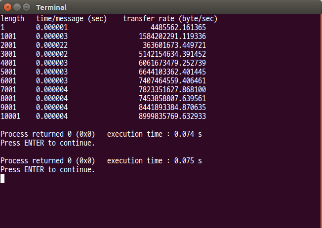
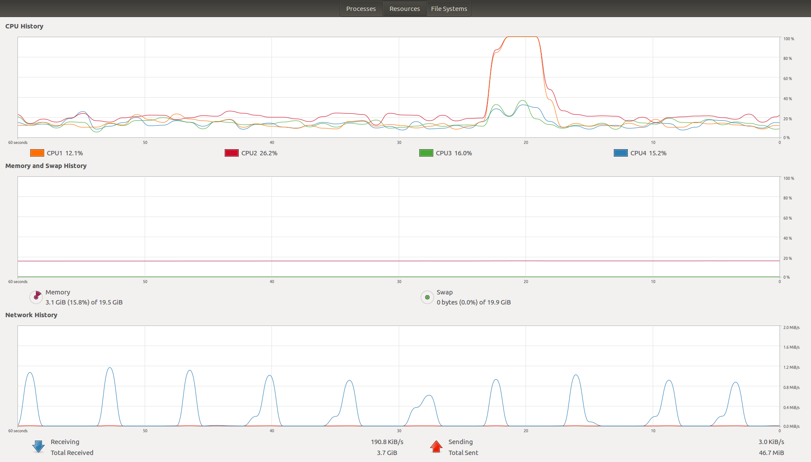
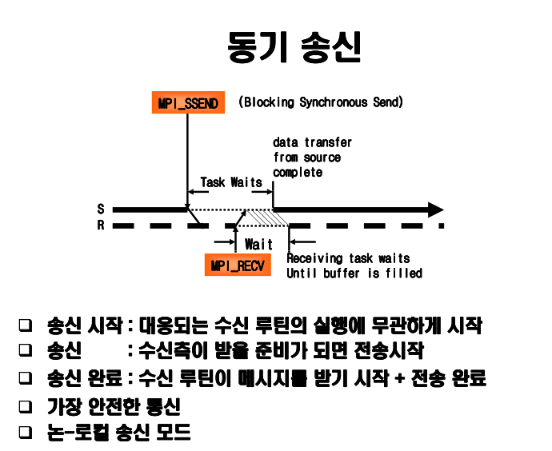
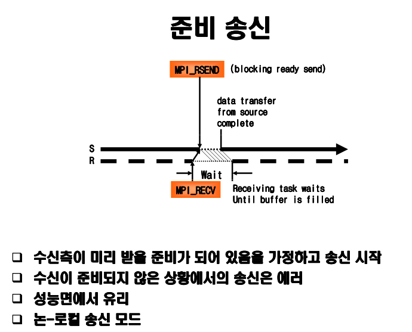
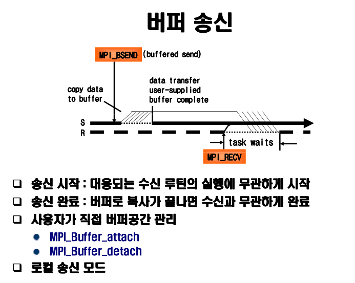
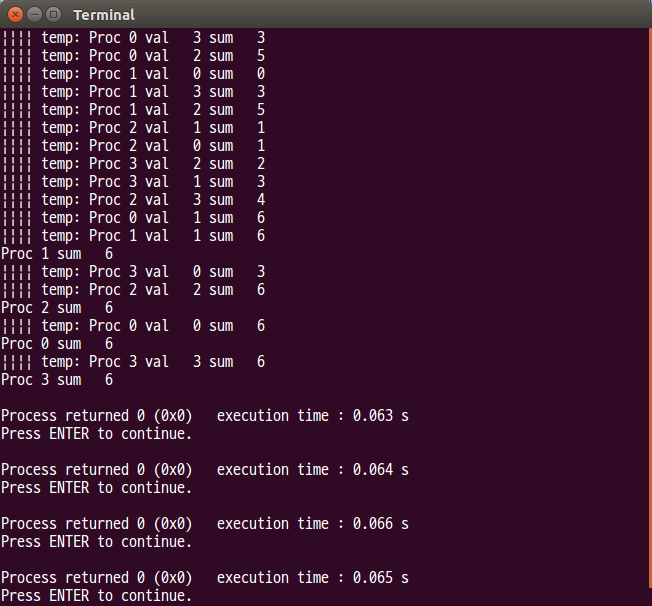

# **3 주차 : MPI 를 이용한 분산 메모리 프로그래밍 -( 프로그래밍 )-**

프로그램 설명

-   제목: Ping-pong 커뮤니케이션 프로그램
-   정의: 위 프로그램은 프로세스 간의 메시지를 전송하는 데 걸리는 비용을 측정한다.

두 개의 프로세스가 정보를 담은 패킷을 100회 교환하면서 걸리는 시간을 측정한다.
길이 1의 실수 배열부터 길이 10001까지 1000회씩 길이를 늘려가며 전송률의 차이를 살펴본다.

시간 측정은 **MPI_Wtime()** 으로 한다(wall clock 측정.)

```c {.line-numbers}
for (length = 1; length <=  10001; length += 1000){

/*-----------------------------------------------------*/
/* Get the start time for the pingpong message passing */
/*-----------------------------------------------------*/

   time = MPI_Wtime();

/*--------------------------------------------------------------*/
/* Process A sends and then receives the message back 100 times */
/*--------------------------------------------------------------*/

   for (i = 1; i <= 100; i++){

       MPI_Ssend(buffer, length, MPI_FLOAT, PROC_B, PING,
                 MPI_COMM_WORLD);

       MPI_Recv(buffer, length, MPI_FLOAT, PROC_B, PONG,
                MPI_COMM_WORLD, &status);

   }

/*------------------------------------------------------*/
/* Get the finish time for the pingpong message passing */
/*------------------------------------------------------*/

   time = MPI_Wtime() - time;

   printf("%d\t %6.6f\t\t%20.6f\n", length, time/200.,
          (float)(2 * sfloat * 100 * length)/time);

}

```




*통신 방식 설명*

-   점대점통신과 통신 모드
-   블록킹 통신
-   논블록킹 통신
-   단방향 통신과 양방향 통신


## Point-to-point Communication

반드시 두 개의 프로세스만 참여하는 통신
통신은 커뮤니케이터 내에서만 이루어 진다.
송신/수신 프로세스의 확인을 위해 커뮤니케이터와 랭크 사용

**통신의 완료**

메시지 전송에 이용된 메모리 위치에 안전하게 접근할 수 있음을 의미

-   송신: 송신 변수는 통신이 완료되면 다시 사용될 수 있음
-   수신: 수신 변수는 통신이 완료된 후부터 사용될 수 있음


## Blocking/non-blocking communication

-  Blocking: 통신이 완료된 후 루틴으로부터 리턴 됨
-  Non-blocking: 통신이 시작되면 완료와 상관없이 리턴, 이후 완료 여부 조사. 따라서, 교착 가능성 제거, 통신 부하 감소

통신 모드  | MPI 호출 루팅  | .
--|---|--
.  | Blocking  | Non-blocking
동기 송신  | MPI_Ssend  | MPI_Issend
준비 송신  | MPI_Rsend  | MPI_Irsend  
버퍼 송신  | MPI_Bsend  | MPI_Ibsend  
표준 송신  | MPI_Send  | MPI_Isend
수신  | MPI_Recv  | MPI_Irecv  









> Ring (Non-blocking Communication)

This exercise requires programming

This program allows a processor to communicate its rank around a ring. The sum of all ranks is then accumulated and printed out by each processor.

Consider a set of processes arranged in a ring as shown below. Use a token passing method to compute the sum of the ranks of the processes.

```c
   1
 /   \
0     2
 \   /
   3
```

Figure 1: Four processes arranged in a ring. Messages are sent from 0 to 1 to 2 to 3 to 0 again, sum of ranks is 6.

Each processor stores its rank in MPI_COMM_WORLD as an integer and sends this value to the processor on its right. It then receives an integer from its left neighbor. It keeps track of the sum of all the integers received. The processors continue passing on the values they receive until they get their own rank back. Each process should finish by printing out the sum of the values.

For this program use synchronous non-blocking send **MPI_Issend()**. *Make sure that you do not overwrite information.*

You are asked to use synchronous message passing because the standard send can be either buffered or synchronous, and you should learn to program for either possibility.

Running this program using 16 processes should have an output similar to the following





## 단/양 방향 통신

1.   선 송신, 후 수신 (블록킹): 메시지 크기에 따라 교착 가능

```c {.line-numbers}
If (myrank==0) {
  MPI_Send(sendbuf, ...);
  MPI_Recv(recvbuf, ...);
}
else if (myrank==1) {
  MPI_Send(sendbuf, ...);
  MPI_Recv(recvbuf, ...);
}
```

2.   선 송신, 후 수신 (논블록킹): 메시지 크기에 따라 교착 가능

```c {.line-numbers}
If (myrank==0) {
  MPI_Isend(sendbuf, ... , ireq, ...);
  MPI_Wait(ireq, ...);
  MPI_Recv(recvbuf, ...);
}
else if (myrank==1) {
  MPI_Isend(sendbuf, ... , ireq, ...);
  MPI_Wait(ireq, ...);
  MPI_Recv(recvbuf, ...);
}
```

3.   **선 송신, 후 수신 (논블로킹, 최종 대기)**: 메시지 크기와 무관하게 교착 없음

```c {.line-numbers}
If (myrank==0) {
  MPI_Isend(sendbuf, ... , ireq, ...);
  MPI_Recv(recvbuf, ...);
  MPI_Wait(ireq, ...);
}
else if (myrank==1) {
  MPI_Isend(sendbuf, ... , ireq, ...);
  MPI_Recv(recvbuf, ...);
  MPI_Wait(ireq, ...);
}
```

4.   선 수신, 후 송신 (블로킹): 메시지 크기와 무관하게 교착

```c {.line-numbers}
If (myrank==0) {
  MPI_Recv(recvbuf, ...);
  MPI_Send(sendbuf, ...);
}
else if (myrank==1) {
  MPI_Recv(recvbuf, ...);
  MPI_Send(sendbuf, ...);
}
```

5.   선 수신, 후 송신 (논블로킹, 최종 대기): 메시지 크기와 무관하게 교착 없음

```c {.line-numbers}
If (myrank==0) {
  MPI_Irecv(recvbuf, ... , ireq, ...);
  MPI_Send(sendbuf, ...);
  MPI_Wait(ireq, ...);
}
else if (myrank==1) {
  MPI_Irecv(recvbuf, ... , ireq, ...);
  MPI_Send(sendbuf, ...);
  MPI_Wait(ireq, ...);
}
```

6.   한쪽은 송신부터, 다른 한쪽은 수신부터: 블록킹, 논블록킹 루틴과 무관하게 교착 없음

```c {.line-numbers}
If (myrank==0) {
  MPI_Send(sendbuf, ...);
  MPI_Recv(recvbuf, ...);
}
else if (myrank==1) {
  MPI_Recv(recvbuf, ...);
  MPI_Send(sendbuf, ...);
}
```
