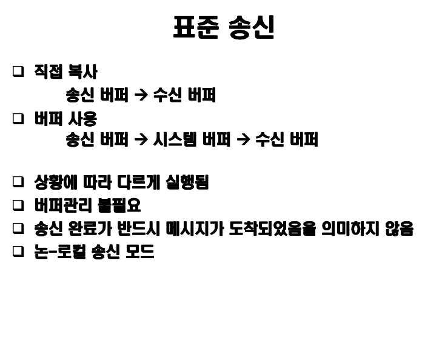

# **3 주차 : MPI 를 이용한 분산 메모리 프로그래밍 -( 프로그래밍 )-**

프로그램 설명

-   제목: Ping-pong 커뮤니케이션 프로그램
-   정의: 위 프로그램은 프로세스 간의 메시지를 전송하는 데 걸리는 비용을 측정한다.

두 개의 프로세스가 정보를 담은 패킷을 100회 교환하면서 걸리는 시간을 측정한다.
길이 1의 실수 배열부터 길이 10001까지 1000회씩 길이를 늘려가며 전송률의 차이를 살펴본다.

시간 측정은 **MPI_Wtime()** 으로 한다(wall clock 측정.)

```c {.line-numbers}
for (length = 1; length <=  10001; length += 1000){

/*-----------------------------------------------------*/
/* Get the start time for the pingpong message passing */
/*-----------------------------------------------------*/

   time = MPI_Wtime();

/*--------------------------------------------------------------*/
/* Process A sends and then receives the message back 100 times */
/*--------------------------------------------------------------*/

   for (i = 1; i <= 100; i++){

       MPI_Ssend(buffer, length, MPI_FLOAT, PROC_B, PING,
                 MPI_COMM_WORLD);

       MPI_Recv(buffer, length, MPI_FLOAT, PROC_B, PONG,
                MPI_COMM_WORLD, &status);

   }

/*------------------------------------------------------*/
/* Get the finish time for the pingpong message passing */
/*------------------------------------------------------*/

   time = MPI_Wtime() - time;

   printf("%d\t %6.6f\t\t%20.6f\n", length, time/200.,
          (float)(2 * sfloat * 100 * length)/time);

}

```


*통신 방식 설명*

-   점대점통신과 통신 모드
-   블록킹 통신
-   논블록킹 통신
-   단방향 통신과 양방향 통신


## Point-to-point Communication

반드시 두 개의 프로세스만 참여하는 통신

통신은 커뮤니케이터 내에서만 이루어 진다.

송신/수신 프로세스의 확인을 위해 커뮤니케이터와 랭크 사용

**통신의 완료**

메시지 전송에 이용된 메모리 위치에 안전하게 접근할 수 있음을 의미

-   송신: 송신 변수는 통신이 완료되면 다시 사용될 수 있음
-   수신: 수신 변수는 통신이 완료된 후부터 사용될 수 있음




## Blocking/non-blocking communication

-  Blocking: 통신이 완료된 후 루틴으로부터 리턴 됨
-  Non-blocking: 통신이 시작되면 완료와 상관없이 리턴, 이후 완료 여부 조사. 따라서, 교착 가능성 제거, 통신 부하 감소

통신 모드  | MPI 호출 루팅  | .
--|---|--
.  | Blocking  | Non-blocking
동기 송신  | MPI_Ssend  | MPI_Issend
준비 송신  | MPI_Rsend  | MPI_Irsend  
버퍼 송신  | MPI_Bsend  | MPI_Ibsend  
표준 송신  | MPI_Send  | MPI_Isend
수신  | MPI_Recv  | MPI_Irecv  

> Ring (Non-blocking Communication)

```c
   1
 /   \
0     2
 \   /
   3
```

Figure 1: 네 개의 프로세서가 링 형태로 할당되어 있다. 메시지들은 프로세스 0에서 1, 1에서 2, 2에서 3, 다시 3에서 0으로 전송되고, 합 연산의 값은 최종 6으로 도출된다.

각각의 프로세서는 자신의 랭크를 val 으로 가지고 있고, 이것을 sum에 합산한다. 메시지를 서로 주고 받으면서 랭크 값(혹은 val)을 넘기는 것을 확인할 수 있다.

동기화 논블로킹 송신 방식인 **MPI_Issend()** 를 사용하고, *정보가 덮어쓰기 되지 않도록 주의한다.*


## 단/양 방향 통신

1.   선 송신, 후 수신 (블록킹): 메시지 크기에 따라 교착 가능

```c {.line-numbers}
If (myrank==0) {
  MPI_Send(sendbuf, ...);
  MPI_Recv(recvbuf, ...);
}
else if (myrank==1) {
  MPI_Send(sendbuf, ...);
  MPI_Recv(recvbuf, ...);
}
```

2.   선 송신, 후 수신 (논블록킹): 메시지 크기에 따라 교착 가능

```c {.line-numbers}
If (myrank==0) {
  MPI_Isend(sendbuf, ... , ireq, ...);
  MPI_Wait(ireq, ...);
  MPI_Recv(recvbuf, ...);
}
else if (myrank==1) {
  MPI_Isend(sendbuf, ... , ireq, ...);
  MPI_Wait(ireq, ...);
  MPI_Recv(recvbuf, ...);
}
```

3.   **선 송신, 후 수신 (논블로킹, 최종 대기)**: 메시지 크기와 무관하게 교착 없음

```c {.line-numbers}
If (myrank==0) {
  MPI_Isend(sendbuf, ... , ireq, ...);
  MPI_Recv(recvbuf, ...);
  MPI_Wait(ireq, ...);
}
else if (myrank==1) {
  MPI_Isend(sendbuf, ... , ireq, ...);
  MPI_Recv(recvbuf, ...);
  MPI_Wait(ireq, ...);
}
```

4.   선 수신, 후 송신 (블로킹): 메시지 크기와 무관하게 교착

```c {.line-numbers}
If (myrank==0) {
  MPI_Recv(recvbuf, ...);
  MPI_Send(sendbuf, ...);
}
else if (myrank==1) {
  MPI_Recv(recvbuf, ...);
  MPI_Send(sendbuf, ...);
}
```

5.   선 수신, 후 송신 (논블로킹, 최종 대기): 메시지 크기와 무관하게 교착 없음

```c {.line-numbers}
If (myrank==0) {
  MPI_Irecv(recvbuf, ... , ireq, ...);
  MPI_Send(sendbuf, ...);
  MPI_Wait(ireq, ...);
}
else if (myrank==1) {
  MPI_Irecv(recvbuf, ... , ireq, ...);
  MPI_Send(sendbuf, ...);
  MPI_Wait(ireq, ...);
}
```

6.   한쪽은 송신부터, 다른 한쪽은 수신부터: 블록킹, 논블록킹 루틴과 무관하게 교착 없음

```c {.line-numbers}
If (myrank==0) {
  MPI_Send(sendbuf, ...);
  MPI_Recv(recvbuf, ...);
}
else if (myrank==1) {
  MPI_Recv(recvbuf, ...);
  MPI_Send(sendbuf, ...);
}
```
