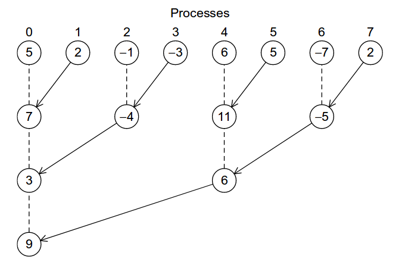

# **4 주차 : MPI 를 이용한 분산 메모리 프로그래밍 -( 프로그래밍 )-**

프로그램 설명

-   제목: 트리 구조 글로벌 합계를 계산하는 프로그램
-   정의: 위 프로그램은 트리 구조에 있는 노드 내의 수를 합산한다.



**배열 초기화**

```c {.line-numbers}
if (my_rank == 0) {
    printf("ARRAY: ");
    arr_num = (int *)malloc(sizeof(int) * SIZE);
    for (i = 0; i < SIZE; i++) {
        arr_num[i] = (rand() % 20 - 10);
        printf("%d ", arr_num[i]);
    }
    printf("\n");
}

per_proc = SIZE/comm_sz;
sub_arr = (int *)malloc(sizeof(int) * per_proc);

MPI_Scatter(arr_num, per_proc, MPI_INT, sub_arr, per_proc, MPI_INT, 0, MPI_COMM_WORLD);
```

1.   배열`arr_num` 안에 임의의 정수를 2의 배수(지금 예제 8)만큼 초기화한다.
2.   현재 시스템의 코어의 갯수`comm_sz = 4`에 맞춰서 전체 데이터`SIZE = 8`를 소단위로 나누어준다.`per_proc = 2`
3.   `MPI_Scatter`를 이용해 배열`arr_num`을 소배열`sub_arr`로 분배한다.

```
$결과창

ARRAY: -7 -4 7 5 3 5 -4 2 -1 -9 -8 -3 0 9 -7 -4
PROC 0: -7 -4 7 7
PROC 3: 0 9 -7 -7
PROC 2: -1 -9 -8 -8
PROC 1: 3 5 -4 -4
```

**소배열 내부 합산**

```c {.line-numbers}
for(i = 0; i < per_proc; i++)
    sub_sum += sub_arr[i];
```

**트리합**

```c {.line-numbers}
for (i = 0, stride = 1, batch_size = 2; stride < comm_sz; i++, stride<<=1, batch_size<<1) {
    if ((my_rank % batch_size) == stride) {
        printf("Send %d from proc %d to %d\n", sub_sum, my_rank, my_rank - stride);
        MPI_Ssend(&sub_sum, 1, MPI_INT, my_rank - stride, 0, MPI_COMM_WORLD);
    }
    if ((my_rank % batch_size) == 0) {
        int sum_from_even;
        MPI_Recv(&sum_from_even, 1, MPI_INT, my_rank + stride, 0, MPI_COMM_WORLD, &status);
        sub_sum += sum_from_even;
        printf("Recv %d from proc %d to %d\n", sum_from_even, my_rank + stride, my_rank);
        printf("#%d SUB_SUM: %d::PROC %d\n", i + 1, sub_sum, my_rank);
    }
}
```

1.   Algorithm: 2의 배수라는 특성을 이용해 for loop 안에서 프로세스 배치를 2의 배수 단위로 묶는다.(e.g. (2), (4), (8), ...)

예를 들어 프로세스가 8개라면

```c
Process 1: Total Processor: (0 1 2 3 4 5 6 7)
Sender Processor number: (1 3 5 7)
Receiver Processor number: (0 2 4 6)
// batch size 2 (S,R): (0,1), (2,3), (4,5), (6,7)

Process 2: Occupied Processor: (0 2 4 6)
Sender Processor number: (2 6)
Receiver Processor number: (0 4)
// batch size 4 (S,-,R,-): (0,1,2,3), (4,5,6,7)

Process 3: Occupied Processor: (0 4)
Sender Processor number: (4)
Receiver Processor number: (0)
// batch size: 8 (S,-,-,-,R,-,-,-): (0 1 2 3 4 5 6 7)
```

이런 식으로 각 단계마다 배치를 형성한다.

2.   Algorithm: 각 랭크와 배치 크기에 맞춰서 Sender와 Receiver를 어떻게 나눌지 분기를 형성해보면 아래와 같다.

```c
Process 1: Total Processor: (0 1 2 3 4 5 6 7)
Sender Processor number: (1 3 5 7)
Receiver Processor number: (0 2 4 6)
// batch size 2 (S,R): (0,1), (2,3), (4,5), (6,7)
//                     (0,1),
//                     (2,3) = (0,1) + 2,
//                     (4,5) = (0,1) + 2^2,
//                     (6,7) = (0,1) + 2^3
// stride 1          : R-S = 1

Process 2: Occupied Processor: (0 2 4 6)
Sender Processor number: (2 6)
Receiver Processor number: (0 4)
// batch size 4 (S,-,R,-): (0,1,2,3), (4,5,6,7)
//                         (0,-,2,-),
//                         (4,-,6,-) = (0,-,2,-) + 4
// stride 2              : R-S = 2


Process 3: Occupied Processor: (0 4)
Sender Processor number: (4)
Receiver Processor number: (0)
// batch size: 8 (S,-,-,-,R,-,-,-): (0 1 2 3 4 5 6 7)
// stride 2                       : R-S = 4

```

```c
$결과창

ARRAY: -7 -4 7 5 3 5 -4 2 -1 -9 -8 -3 0 9 -7 -4
PROC 0: -7 -4 7 7
PROC 2: -1 -9 -8 -8
PROC 1: 3 5 -4 -4
Send 6 from proc 1 to 0
Recv 6 from proc 1 to 0
#1 SUB_SUM: 7::PROC 0
PROC 3: 0 9 -7 -7
Send -2 from proc 3 to 2
Recv -2 from proc 3 to 2
#1 SUB_SUM: -23::PROC 2
Send -23 from proc 2 to 0
Recv -23 from proc 2 to 0
#2 SUB_SUM: -16::PROC 0

::Total summation is -16::
```
