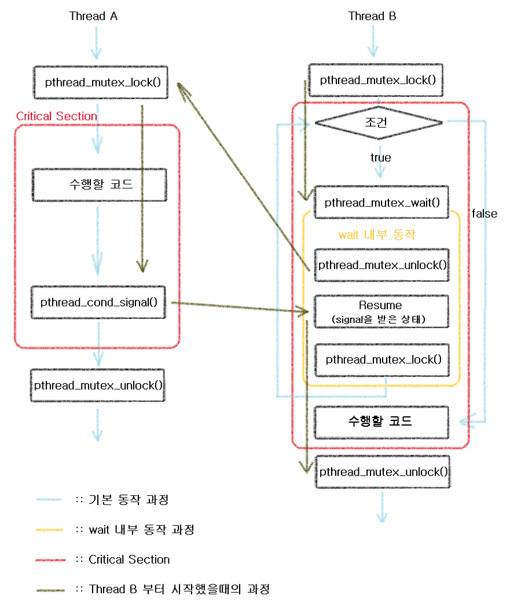

# Mutex condition

지금까지 알아본 뮤텍스(lock, unlock, destroy만으로 구성된 뮤텍스)는 리소스에 대한 베타적 접근이라는 간단한 동기화를 제공해줌을 알수있다.

하지만 이렇게 구성된 뮤텍스로는 기능이 한계를 보이게 되고, 좀더 정밀한 뮤텍스가 필요한 시점이 생겼다.

**조건 변수를 이용한 뮤텍스** 이다.

조건 변수는 어떤 일이 발생할 때 까지 _CPU 사이클을 낭비하지 않고 기다릴 수 있도록 해 주는 메커니즘_ 이 핵심이다.

또한 스레드는 서로 어떤 사건에 대해 상대방에게 통보할 수 있는 방식이 필요한 경우가 있으므로 조건 변수를 사용한다.

예를들어,

서버와 클라이언트가 있는데 서버에서 제공해주는 내용들을 다 제공해주기 전에 클라이언트가 종료하면 서버는 그것에 대해 맞는 행동을 즉각 해야한다. 이러한 것이 모두 조건 변수가 없다면 행하기 힘들것이다. (EX : 동영상)

**왜 Mutex Condition이 필요한가?  lock(), unlock() 이것 두개만으로는 해결할 수 없는가?**

예를 들어보자.

메인 스레드에서 스레드 A,B 두개를 생성하였고 여기서 조건은 스레드 A의 기능이 먼저 작동하도록 하여야 한다.

만약 스레드 B가 먼저 작동하면, 구하고자 하는 결과가 달라지기에 무조건 스레드 A가 먼저 돌아가도록 하여야한다.

이때, 프로그래머는 적절한 조취를 취할 것이다. 예를들자면 flag를 두어 flag가 0일때 A가 돌도록하고 B에 행여나 먼저 들어갔다면 while(flag == 0){} 이런 방식으로 할 수 있을 것이다.

이렇게 짜면 되지 않나? 라는 생각은 매우 위험하다.

이미 B에 먼저오게 되면 저러한 조취를 취해야 하는데, 저런 행동은 busy waiting을 초래한다.

**busy wating** :: 그 값이 계속 변했나 프로세스 혹은 스레드에서 계속해서 확인하는 방식,

 이 방식은 CPU를 100%에 도달하도록 만드는 resource 소모가 심한 방식이다.

따라서 뮤텍스를 이용하는 다른 방식이 필요하게 되었다.

그 방식이 바로 Mutex Condition이다.

## 조건 변수 기본 동작 Process

```c
thread 1

메인 프로세스, create thread를 하고,  필요에 따라 join thread를 해준다.
```

```c
thread 2  

while (1)
{
    mutex lock();

    // critical section ----------------------------------------------

        thread 2에서 수행하고자 하는 코드 작성

        pthrad_cond_signal(); 을 이용해서 조건 변수를 통해 신호를 보낸다.

    // end of critical section ---------------------------------------

    mutex unlock();
}
```

```c
thread 3

 while(1)
 {
     mutex lock();

     // critical section ----------------------------------------------

     while (프로그래머가 지정하는 특정 조건 (condition과는 다른 조건이어도 된다.))
     {
          pthread_cond_wait(); 를 이용해서 조건변수를 통해 신호가 오는지 기다린다.   
     }

     thread 3에서 수행하고자 하는 코드 작성

     // end of critical section ---------------------------------------

     mutex unlock();
 }
```

> 기본 동작은 아래와 같다.


> Thread B가 먼저 lock을 걸었다면 다음과 같이 동작한다.



## Condition에 관련된 함수 이용 방법

```c
pthread_cond_t 원하는 이름 = PTHREAD_COND_INITIALIZER;
```

-> Condition 객체를 생성한다.

```c
pthread_cond_wait(&컨디션 이름, &뮤텍스 이름);
```

조건 변수가 신호를 받을 때까지 기다리는 역할을 한다.

실제로 내부적으로는 pthread_unlock_mutex() 를 통해 mutex 를 unlock하고

cond 조건 변수가 시그널을 받을 때까지 기다린다.

조건 변수가 신호를 받아 다시 스레드가 깨어 나게되면 pthread_cond_wait()함수는


pthread_lock_mutex() 를 통해 mutex 에 다시 lock을 겁니다.

즉, wait -> (unlock -> if(condition) -> resume -> lock) -> 프로그래머가 지정한 수행 코드 -> unlock 과정을 거친다.

( '( ~ )' 의 내용은 wait가 실제로 내부적으로 하는 행동을 의미)

```c
pthread_cond_signal(&컨디션 명);
```

cond 조건 변수에 신호를 보내 이 cond조건 변수를 기다리고 있는 스레드 중의 하나를 다시 시작시키게 된다.

이때 cond 조건 변수를 기다리고 있는 스레드가 없다면, 아무 일도 일어나지 않는다.

그리고 cond 조건 변수를 기다리는 스레드가 여러 개라면,

**그 중의 하나만 깨어나지만, 특정 스레드를 지정할 수는 없다. (즉, 무슨 스레드가 깨어날 지는 아무도 모른다.)**

```c
pthread_cond_broadcast(&컨디션 명);
```

cond 조건 변수를 기다리고 있는 모든 스레드를 다시 시작시킨다.

signal과 마찬가지로 cond 조건 변수를 기다리고 있는 스레드가 없다면, 아무 일도 일어나지 않는다.

```c
pthread_cond_destroy(&컨디션 명);
```

조건 변수를 삭제하고, 조건 변수에 할당된 자원을 해제한다.

pthread_cond_destroy()함수가 실행될 때 어떤 스레드도 해당 조건 변수를 기다리고 있어서는 안된다.

만약 아직도 조건변수가 신호를 받기를 기다리는 스레드가 있다면 EBUSY라는 에러 코드를 리턴한다.

참고 :: Linux에서는 조건 변수에 할당되는 자원이 없다.

결국 pthread_cond_destroy()함수는 조건 변수를 기다리고 있는

스레드가 있는지 검사하는 일 외에는 아무 작업도 하지 않는다.

# 예제

> Ping / Pong 중 Pong이 먼저 실행된 경우
> wait에 들어가게 되어 ping이 signal을 줄 때 까지 기다리게 된다.

> Ping / Pong 중 Ping이 먼저 실행된 경우
> 순서에 맞게 진행된다.

```c {.line-numbers}
#include <stdio.h>
#include <pthread.h>

// pp ;: pingpong
pthread_mutex_t ppmutex = PTHREAD_MUTEX_INITIALIZER;
pthread_cond_t ppcond = PTHREAD_COND_INITIALIZER;
int flag = 0;

void *ping(void *argumentPointer)
{
    int i = 0;

    printf("ping 먼저 \n");
    while(i <= 100)
    {
            pthread_mutex_lock(&ppmutex);

            printf("ping :: %d\n",i);
            i++;
            flag = 1;

            pthread_cond_signal(&ppcond);

            pthread_cond_wait(&ppcond,&ppmutex);

            pthread_mutex_unlock(&ppmutex);

    }
    return NULL;
}


void *pong(void *argumentPointer)
{
    int i = 0;

    printf("pong 먼저 \n");
    while(i <= 100)
    {
        pthread_mutex_lock(&ppmutex);

        while(flag == 0)
            pthread_cond_wait(&ppcond, &ppmutex);

        flag = 0;
        printf("pong :: %d\n",i);
        i++;

        pthread_cond_signal(&ppcond);

        pthread_mutex_unlock(&ppmutex);

    }
    return NULL;
}


int main()
{
    pthread_t threadID1, threadID2;

    // Create < 뮤텍스 이용 >
    pthread_create(&threadID1, NULL, ping, NULL);
    pthread_create(&threadID2, NULL, pong, NULL);

    // Join < 뮤텍스 이용 >
    pthread_join(threadID1, NULL);
    pthread_join(threadID2, NULL);

    printf("Ping Pong finish !! \n");
    return 0;
}
```

> 만약 pong의 while문과 flag 없이 그냥 wait만 있다면?
>
> Ping / Pong 중 Ping이 먼저 실행된 경우
> **데드락이 걸리게 된다.**
> ping 스레드가 먼저 돌고 0을 출력 후,
> signal을 실행하고 wait를 실행하고 난 뒤,
> 컨텍스트 스위칭 (ping wait에서 unlock하고 condition value를 기다린다.)
> pong 스레드가 시작되며 wait를 하게되면 ping과 pong이 모두 wait상태에서 데드락이 걸린다.

> Ping / Pong 중 Pong이 먼저 실행된 경우
> 문제없이 진행된다.
> 즉, pong에서 lock 걸고 -> wait하면 ping에서 lock걸고 signal하고 wait를 하여도 이미 pong의 wait가 풀려있기에 데드락이 걸리지 않는다.

```c {.line-numbers}
#include <stdio.h>
#include <pthread.h>

// pp ;: pingpong
pthread_mutex_t ppmutex = PTHREAD_MUTEX_INITIALIZER;
pthread_cond_t ppcond = PTHREAD_COND_INITIALIZER;
int flag = 0;

void *ping(void *argumentPointer)
{
    int i = 0;

    printf("ping 먼저 \n");
    while(i <= 100)
    {
            pthread_mutex_lock(&ppmutex);

            printf("ping :: %d\n",i);
            i++;
            //flag = 1;

            pthread_cond_signal(&ppcond);

            pthread_cond_wait(&ppcond,&ppmutex);

            pthread_mutex_unlock(&ppmutex);

    }
    return NULL;
}


void *pong(void *argumentPointer)
{
    int i = 0;

    printf("pong 먼저 \n");
    while(i <= 100)
    {
        pthread_mutex_lock(&ppmutex);

        //while(flag == 0)
            pthread_cond_wait(&ppcond, &ppmutex);

        //flag = 0;
        printf("pong :: %d\n",i);
        i++;

        pthread_cond_signal(&ppcond);

        pthread_mutex_unlock(&ppmutex);

    }
    return NULL;
}


int main()
{
    pthread_t threadID1, threadID2;

    // Create < 뮤텍스 이용 >
    pthread_create(&threadID1, NULL, ping, NULL);
    pthread_create(&threadID2, NULL, pong, NULL);

    // Join < 뮤텍스 이용 >
    pthread_join(threadID1, NULL);
    pthread_join(threadID2, NULL);

    printf("Ping Pong finish !! \n");
    return 0;
}
```
