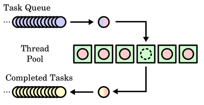
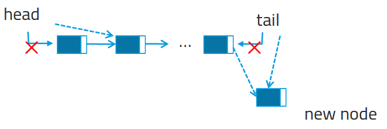

# Task Queue

## Thread pool

스레드가 계속 추가되면 자원이 고갈될 수 있다. 이 문제는 Thread Pool에 의해 해결 가능하다. Thread Pool은 프로세스 시작 시부터 미리 여러 스레드를 생성해놓고, 프로세스에서 필요한 만큼의 스레드를 가져다 쓰는 방식이다. 유휴 스레드가 없다면, 프로세스는 대기해야 한다. task는 유휴 스레드에 배치되어 실행된다.



스레드 풀은 3가지 장점이 있다.

1. 새 스레드를 만드는 것보다 pool에서 가져다 쓰는 게 빠르다. (이미 생성한 스레드이므로)
2. 스레드 수를 제한하여 자원 고갈을 막는다.
3. task 생성과 수행이 별도이기 때문에 다양한 전략이 사용 가능하다.
    (task는 생성되면 task queue에 들어가게 되는데, task queue에 있는 task들을 실행할 방법을 여러       가지로 정할 수 있게 된다. (ex. 지연 실행 또는 주기적 실행))

### 작업 저장 및 대기 (Queue 자료 구조의 특징)

**Insertation**



```c {.line-numbers}
/**
 * Adds a calculation task to queue.
 */
void submit_work(int a, int b, int type) {
    /* dynamically allocate a work task */
    work_t * work = malloc(sizeof(work_t));

    work->a = a;
    work->b = b;
    work->type = type;

    /* lock the queue to avoid thread access */
    pthread_mutex_lock(&mutex);

    /* add work task to work queue */
    QUEUE_INIT(&work->node);
    QUEUE_INSERT_TAIL(&queue, &work->node);
      /**    QUEUE_NEXT(q) = (h);                                             \
       *     QUEUE_PREV(q) = QUEUE_PREV(h);                                   \
       *     QUEUE_PREV_NEXT(q) = (q);                                        \
       *     QUEUE_PREV(h) = (q);                                             \
       */

    /* free the lock */
    pthread_mutex_unlock(&mutex);

    /* signal a thread that it should check for new work */
    pthread_cond_signal(&cond);
}
```

여기서 중요한 것은 노드의 탐색은 변경 사항이 없으므로 뮤텍스를 설정하지 않지만, 삽입 같은 경우는 뮤텍스로 잠가두어야 크리티컬 섹션에서 래이스 컨디션이 발생하는 것을 막을 수 있다.

또한, 나중에 큐가 비어있는 특정 조건을 구분하기 위해 현재 노드를 추가할 때 시그널을 발생 시킨다.


### 작업 진행 (큐에서 작업 빼내기)

```c {.line-numbers}
void * worker() {
    QUEUE * q;

    int result;

    work_t * work;

    for (;;) {
        pthread_mutex_lock(&mutex);

        while (QUEUE_EMPTY(&queue)) {
            pthread_cond_wait(&cond, &mutex);
        }

        q = QUEUE_HEAD(&queue);

        work = QUEUE_DATA(q, work_t, node);

        QUEUE_REMOVE(q);

        pthread_mutex_unlock(&mutex);


        switch (work->type) {
            case 1:
                result = work->a + work->b;
                printf("%d + %d = %d\n", work->a, work->b, result);
                break;
            case 2:
                result = work->a - work->b;
                printf("%d - %d = %d\n", work->a, work->b, result);
                break;
            case 3:
                result = work->a * work->b;
                printf("%d * %d = %d\n", work->a, work->b, result);
                break;
            case 4:
                result = work->a / work->b;
                printf("%d / %d = %d\n", work->a, work->b, result);
                break;
        }

        free(work);
    }

    pthread_exit(NULL);
}
```
